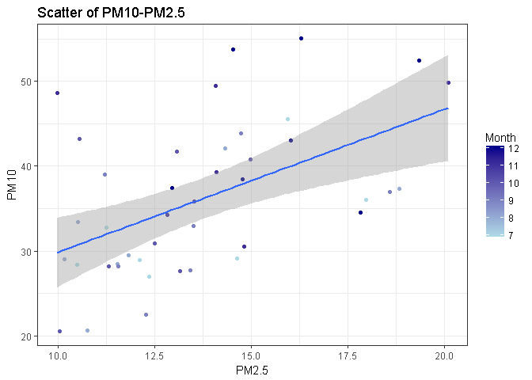

長庚大學 大數據分析方法 作業六
================

分析議題背景
------------

PM 就是英文Particulate Matter（顆粒物）的縮寫。 PM10代表空氣中空氣動力學粒徑小於等於10微米的所有顆粒物； PM2.5代表空氣中空氣動力學粒徑小於等於2.5微米的所有顆粒物；又稱細顆粒，細顆粒進入肺泡。 由此可見，PM10中包含粒徑小於2.5微米的顆粒物，即PM10包含PM2.5。世界衛生組織（WHO）指出： 對於發展中國家的城市：PM10中有近一半是PM2.5； 對於已開發國家城市:PM10中PM2.5占50%至80%。由此，當空氣中PM2.5的濃度數據增加時，PM10的濃度數據就會升高。故目前歐盟國家仍然只監測PM10的濃度數據。 PM10能被人直接吸入呼吸道，但部分可通過痰液等排出體外，也會被鼻腔內部的絨毛阻擋，對人體健康危害相對較小。不過PM10對於能見度和溫度的影響非常明顯。 PM2.5通過呼吸可以到達肺部。這些顆粒物在肺泡上沉積下來，會干擾肺部的氣體交換，損傷肺泡和粘膜，引起肺組織的慢性纖維化，導致肺心病，加重哮喘病，引起慢性鼻咽炎、慢性支氣管炎等一系列病變，這些顆粒物還可以通過支氣管和肺泡進入血液，其中的有害氣體、重金屬等溶解在血液中，嚴重的可危及生命，對兒童和老年人的危害尤為明顯。

分析動機
--------

相信大家都對PM10及PM2.5這幾個名詞不陌生了，也知道它對人體健康會有危害，因此我們找出開放資料，就北部幾個區域於2016/12/31這一天的情況來比較看看到底是哪裡的空氣最髒，再來看看工廠在各區的分布多寡和空氣汙染的高低有沒有關聯。

使用資料
--------

關於讀入資料之欄位名稱及內容說明 普通測站資料註記說明： \`\# 表示儀器檢核為無效值 \* 表示程式檢核為無效值 x 表示人工檢核為無效值 NR 表示無降雨 空白 表示缺值

測項簡稱 單位 測項名稱 SO2 ppb 二氧化硫 CO ppm 一氧化碳 O3 ppb 臭氧 PM10 μg/m3 懸浮微粒 PM2.5 μg/m3 細懸浮微粒 NOX ppb 氮氧化物 NO ppb 一氧化氮 NO2 ppb 二氧化氮 THC ppm 總碳氫合物 NMHC ppm 非甲烷碳氫化合物 CH4 ppm 甲烷 UVB UVI 紫外線指數 AMB\_TEMP ℃ 大氣溫度 RAINFALL mm 雨量 RH % 相對溼度 WIND\_SPEED m/sec 風速(以每小時最後10分鐘算術平均) WIND\_DIREC degress 風向(以每小時最後10分鐘向量平均) WS\_HR m/sec 風速小時值(以整個小時算術平均) WD\_HR degress 風向小時值(以整個小時向量平均) PH\_RAIN pH 酸鹼值(酸雨) RAIN\_COND μS/cm 導電度(酸雨)

載入使用資料們

``` r
#這是R Code Chunk
library(readr)
```

    ## Warning: package 'readr' was built under R version 3.3.3

``` r
library(readxl)
```

    ## Warning: package 'readxl' was built under R version 3.3.3

``` r
Banqiao <- read_excel("D:/BigDataHW/HW6/NewTaipeiCity/105年板橋站_20170217.xls")
Linkou <- read_excel("D:/BigDataHW/HW6/NewTaipeiCity/105年林口站_20170217.xls")
Sanchong <- read_excel("D:/BigDataHW/HW6/NewTaipeiCity/105年三重站_20170217.xls")
Tanshui <- read_excel("D:/BigDataHW/HW6/NewTaipeiCity/105年淡水站_20170217.xls")
```

    ## Warning in xls_cols(path, sheet, col_names = col_names, col_types =
    ## col_types, : Expecting numeric in [105, 17] got `0*`

    ## Warning in xls_cols(path, sheet, col_names = col_names, col_types =
    ## col_types, : Expecting numeric in [105, 18] got `0*`

    ## Warning in xls_cols(path, sheet, col_names = col_names, col_types =
    ## col_types, : Expecting numeric in [105, 20] got `1000*`

    ## Warning in xls_cols(path, sheet, col_names = col_names, col_types =
    ## col_types, : Expecting numeric in [115, 16] got `18*`

    ## Warning in xls_cols(path, sheet, col_names = col_names, col_types =
    ## col_types, : Expecting numeric in [118, 14] got `0.6#`

    ## Warning in xls_cols(path, sheet, col_names = col_names, col_types =
    ## col_types, : Expecting numeric in [119, 14] got `2.2#`

    ## Warning in xls_cols(path, sheet, col_names = col_names, col_types =
    ## col_types, : Expecting numeric in [119, 18] got `2.4#`

    ## Warning in xls_cols(path, sheet, col_names = col_names, col_types =
    ## col_types, : Expecting numeric in [120, 14] got `9.8#`

    ## Warning in xls_cols(path, sheet, col_names = col_names, col_types =
    ## col_types, : Expecting numeric in [120, 18] got `7.4#`

    ## Warning in xls_cols(path, sheet, col_names = col_names, col_types =
    ## col_types, : Expecting numeric in [121, 14] got `12#`

    ## Warning in xls_cols(path, sheet, col_names = col_names, col_types =
    ## col_types, : Expecting numeric in [121, 18] got `9.8#`

    ## Warning in xls_cols(path, sheet, col_names = col_names, col_types =
    ## col_types, : Expecting numeric in [122, 14] got `35#`

    ## Warning in xls_cols(path, sheet, col_names = col_names, col_types =
    ## col_types, : Expecting numeric in [124, 9] got `55*`

    ## Warning in xls_cols(path, sheet, col_names = col_names, col_types =
    ## col_types, : Expecting numeric in [124, 10] got `58*`

    ## Warning in xls_cols(path, sheet, col_names = col_names, col_types =
    ## col_types, : Expecting numeric in [124, 14] got `1#`

    ## Warning in xls_cols(path, sheet, col_names = col_names, col_types =
    ## col_types, : Expecting numeric in [125, 14] got `2.7#`

    ## Warning in xls_cols(path, sheet, col_names = col_names, col_types =
    ## col_types, : Expecting numeric in [181, 15] got `0.27#`

    ## Warning in xls_cols(path, sheet, col_names = col_names, col_types =
    ## col_types, : Expecting numeric in [181, 16] got `0.23#`

    ## Warning in xls_cols(path, sheet, col_names = col_names, col_types =
    ## col_types, : Expecting numeric in [181, 18] got `0.23#`

    ## Warning in xls_cols(path, sheet, col_names = col_names, col_types =
    ## col_types, : Expecting numeric in [181, 20] got `0.22x`

    ## Warning in xls_cols(path, sheet, col_names = col_names, col_types =
    ## col_types, : Expecting numeric in [181, 21] got `0.24#`

    ## Warning in xls_cols(path, sheet, col_names = col_names, col_types =
    ## col_types, : Expecting numeric in [182, 15] got `2.5#`

    ## Warning in xls_cols(path, sheet, col_names = col_names, col_types =
    ## col_types, : Expecting numeric in [182, 16] got `2.7#`

    ## Warning in xls_cols(path, sheet, col_names = col_names, col_types =
    ## col_types, : Expecting numeric in [182, 18] got `-0.1#`

    ## Warning in xls_cols(path, sheet, col_names = col_names, col_types =
    ## col_types, : Expecting numeric in [182, 20] got `1.6#`

    ## Warning in xls_cols(path, sheet, col_names = col_names, col_types =
    ## col_types, : Expecting numeric in [183, 15] got `14#`

    ## Warning in xls_cols(path, sheet, col_names = col_names, col_types =
    ## col_types, : Expecting numeric in [183, 16] got `9.8#`

    ## Warning in xls_cols(path, sheet, col_names = col_names, col_types =
    ## col_types, : Expecting numeric in [183, 20] got `7.5#`

    ## Warning in xls_cols(path, sheet, col_names = col_names, col_types =
    ## col_types, : Expecting numeric in [184, 15] got `17#`

    ## Warning in xls_cols(path, sheet, col_names = col_names, col_types =
    ## col_types, : Expecting numeric in [184, 16] got `13#`

    ## Warning in xls_cols(path, sheet, col_names = col_names, col_types =
    ## col_types, : Expecting numeric in [184, 18] got `-0.9#`

    ## Warning in xls_cols(path, sheet, col_names = col_names, col_types =
    ## col_types, : Expecting numeric in [184, 20] got `9#`

    ## Warning in xls_cols(path, sheet, col_names = col_names, col_types =
    ## col_types, : Expecting numeric in [185, 15] got `27#`

    ## Warning in xls_cols(path, sheet, col_names = col_names, col_types =
    ## col_types, : Expecting numeric in [185, 16] got `31#`

    ## Warning in xls_cols(path, sheet, col_names = col_names, col_types =
    ## col_types, : Expecting numeric in [188, 15] got `0.8#`

    ## Warning in xls_cols(path, sheet, col_names = col_names, col_types =
    ## col_types, : Expecting numeric in [188, 16] got `1#`

    ## Warning in xls_cols(path, sheet, col_names = col_names, col_types =
    ## col_types, : Expecting numeric in [188, 18] got `0.7#`

    ## Warning in xls_cols(path, sheet, col_names = col_names, col_types =
    ## col_types, : Expecting numeric in [188, 22] got `1.5#`

    ## Warning in xls_cols(path, sheet, col_names = col_names, col_types =
    ## col_types, : Expecting numeric in [189, 15] got `1.4#`

    ## Warning in xls_cols(path, sheet, col_names = col_names, col_types =
    ## col_types, : Expecting numeric in [190, 14] got `0.71#`

    ## Warning in xls_cols(path, sheet, col_names = col_names, col_types =
    ## col_types, : Expecting numeric in [190, 15] got `0.35#`

    ## Warning in xls_cols(path, sheet, col_names = col_names, col_types =
    ## col_types, : Expecting numeric in [191, 14] got `12#`

    ## Warning in xls_cols(path, sheet, col_names = col_names, col_types =
    ## col_types, : Expecting numeric in [191, 15] got `2.4#`

    ## Warning in xls_cols(path, sheet, col_names = col_names, col_types =
    ## col_types, : Expecting numeric in [192, 14] got `30#`

    ## Warning in xls_cols(path, sheet, col_names = col_names, col_types =
    ## col_types, : Expecting numeric in [192, 15] got `13#`

    ## Warning in xls_cols(path, sheet, col_names = col_names, col_types =
    ## col_types, : Expecting numeric in [193, 14] got `42#`

    ## Warning in xls_cols(path, sheet, col_names = col_names, col_types =
    ## col_types, : Expecting numeric in [193, 15] got `15#`

    ## Warning in xls_cols(path, sheet, col_names = col_names, col_types =
    ## col_types, : Expecting numeric in [194, 14] got `19#`

    ## Warning in xls_cols(path, sheet, col_names = col_names, col_types =
    ## col_types, : Expecting numeric in [194, 15] got `19#`

    ## Warning in xls_cols(path, sheet, col_names = col_names, col_types =
    ## col_types, : Expecting numeric in [197, 14] got `1.6#`

    ## Warning in xls_cols(path, sheet, col_names = col_names, col_types =
    ## col_types, : Expecting numeric in [197, 15] got `1.6#`

    ## Warning in xls_cols(path, sheet, col_names = col_names, col_types =
    ## col_types, : Expecting numeric in [217, 14] got `0.22#`

    ## Warning in xls_cols(path, sheet, col_names = col_names, col_types =
    ## col_types, : Expecting numeric in [218, 14] got `2#`

    ## Warning in xls_cols(path, sheet, col_names = col_names, col_types =
    ## col_types, : Expecting numeric in [219, 14] got `4.1#`

    ## Warning in xls_cols(path, sheet, col_names = col_names, col_types =
    ## col_types, : Expecting numeric in [220, 14] got `6.1#`

    ## Warning in xls_cols(path, sheet, col_names = col_names, col_types =
    ## col_types, : Expecting numeric in [221, 13] got `29#`

    ## Warning in xls_cols(path, sheet, col_names = col_names, col_types =
    ## col_types, : Expecting numeric in [224, 14] got `1.1#`

    ## Warning in xls_cols(path, sheet, col_names = col_names, col_types =
    ## col_types, : Expecting numeric in [235, 20] got `0.25#`

    ## Warning in xls_cols(path, sheet, col_names = col_names, col_types =
    ## col_types, : Expecting numeric in [236, 15] got `6.4*`

    ## Warning in xls_cols(path, sheet, col_names = col_names, col_types =
    ## col_types, : Expecting numeric in [236, 20] got `0.6#`

    ## Warning in xls_cols(path, sheet, col_names = col_names, col_types =
    ## col_types, : Expecting numeric in [237, 15] got `14*`

    ## Warning in xls_cols(path, sheet, col_names = col_names, col_types =
    ## col_types, : Expecting numeric in [237, 20] got `6#`

    ## Warning in xls_cols(path, sheet, col_names = col_names, col_types =
    ## col_types, : Expecting numeric in [238, 15] got `20*`

    ## Warning in xls_cols(path, sheet, col_names = col_names, col_types =
    ## col_types, : Expecting numeric in [238, 20] got `6.6#`

    ## Warning in xls_cols(path, sheet, col_names = col_names, col_types =
    ## col_types, : Expecting numeric in [239, 20] got `37#`

    ## Warning in xls_cols(path, sheet, col_names = col_names, col_types =
    ## col_types, : Expecting numeric in [242, 20] got `1.6#`

    ## Warning in xls_cols(path, sheet, col_names = col_names, col_types =
    ## col_types, : Expecting numeric in [243, 20] got `0.1#`

    ## Warning in xls_cols(path, sheet, col_names = col_names, col_types =
    ## col_types, : Expecting numeric in [244, 15] got `0.45#`

    ## Warning in xls_cols(path, sheet, col_names = col_names, col_types =
    ## col_types, : Expecting numeric in [245, 15] got `8.4#`

    ## Warning in xls_cols(path, sheet, col_names = col_names, col_types =
    ## col_types, : Expecting numeric in [246, 15] got `27#`

    ## Warning in xls_cols(path, sheet, col_names = col_names, col_types =
    ## col_types, : Expecting numeric in [247, 15] got `35#`

    ## Warning in xls_cols(path, sheet, col_names = col_names, col_types =
    ## col_types, : Expecting numeric in [248, 15] got `11#`

    ## Warning in xls_cols(path, sheet, col_names = col_names, col_types =
    ## col_types, : Expecting numeric in [251, 15] got `5.4#`

    ## Warning in xls_cols(path, sheet, col_names = col_names, col_types =
    ## col_types, : Expecting numeric in [252, 15] got `1.4#`

    ## Warning in xls_cols(path, sheet, col_names = col_names, col_types =
    ## col_types, : Expecting numeric in [272, 15] got `2#`

    ## Warning in xls_cols(path, sheet, col_names = col_names, col_types =
    ## col_types, : Expecting numeric in [273, 15] got `1.7#`

    ## Warning in xls_cols(path, sheet, col_names = col_names, col_types =
    ## col_types, : Expecting numeric in [274, 15] got `3.7#`

    ## Warning in xls_cols(path, sheet, col_names = col_names, col_types =
    ## col_types, : Expecting numeric in [343, 14] got `0.37#`

    ## Warning in xls_cols(path, sheet, col_names = col_names, col_types =
    ## col_types, : Expecting numeric in [344, 14] got `2.7#`

    ## Warning in xls_cols(path, sheet, col_names = col_names, col_types =
    ## col_types, : Expecting numeric in [345, 14] got `14#`

    ## Warning in xls_cols(path, sheet, col_names = col_names, col_types =
    ## col_types, : Expecting numeric in [346, 14] got `16#`

    ## Warning in xls_cols(path, sheet, col_names = col_names, col_types =
    ## col_types, : Expecting numeric in [347, 14] got `43#`

    ## Warning in xls_cols(path, sheet, col_names = col_names, col_types =
    ## col_types, : Expecting numeric in [350, 14] got `2.4#`

    ## Warning in xls_cols(path, sheet, col_names = col_names, col_types =
    ## col_types, : Expecting numeric in [367, 10] got `1#`

    ## Warning in xls_cols(path, sheet, col_names = col_names, col_types =
    ## col_types, : Expecting numeric in [433, 15] got `0.61#`

    ## Warning in xls_cols(path, sheet, col_names = col_names, col_types =
    ## col_types, : Expecting numeric in [434, 15] got `9.7#`

    ## Warning in xls_cols(path, sheet, col_names = col_names, col_types =
    ## col_types, : Expecting numeric in [435, 15] got `31#`

    ## Warning in xls_cols(path, sheet, col_names = col_names, col_types =
    ## col_types, : Expecting numeric in [436, 15] got `40#`

    ## Warning in xls_cols(path, sheet, col_names = col_names, col_types =
    ## col_types, : Expecting numeric in [437, 15] got `12#`

    ## Warning in xls_cols(path, sheet, col_names = col_names, col_types =
    ## col_types, : Expecting numeric in [440, 15] got `2.6#`

    ## Warning in xls_cols(path, sheet, col_names = col_names, col_types =
    ## col_types, : Expecting numeric in [469, 14] got `0.42#`

    ## Warning in xls_cols(path, sheet, col_names = col_names, col_types =
    ## col_types, : Expecting numeric in [470, 14] got `9.9#`

    ## Warning in xls_cols(path, sheet, col_names = col_names, col_types =
    ## col_types, : Expecting numeric in [471, 14] got `20#`

    ## Warning in xls_cols(path, sheet, col_names = col_names, col_types =
    ## col_types, : Expecting numeric in [472, 14] got `30#`

    ## Warning in xls_cols(path, sheet, col_names = col_names, col_types =
    ## col_types, : Expecting numeric in [473, 14] got `31#`

    ## Warning in xls_cols(path, sheet, col_names = col_names, col_types =
    ## col_types, : Expecting numeric in [476, 14] got `4.5#`

    ## Warning in xls_cols(path, sheet, col_names = col_names, col_types =
    ## col_types, : Expecting numeric in [532, 12] got `0.31#`

    ## Warning in xls_cols(path, sheet, col_names = col_names, col_types =
    ## col_types, : Expecting numeric in [532, 18] got `0.46#`

    ## Warning in xls_cols(path, sheet, col_names = col_names, col_types =
    ## col_types, : Expecting numeric in [533, 11] got `1.1#`

    ## Warning in xls_cols(path, sheet, col_names = col_names, col_types =
    ## col_types, : Expecting numeric in [533, 17] got `1.2#`

    ## Warning in xls_cols(path, sheet, col_names = col_names, col_types =
    ## col_types, : Expecting numeric in [534, 11] got `5.6#`

    ## Warning in xls_cols(path, sheet, col_names = col_names, col_types =
    ## col_types, : Expecting numeric in [534, 17] got `5#`

    ## Warning in xls_cols(path, sheet, col_names = col_names, col_types =
    ## col_types, : Expecting numeric in [535, 11] got `6.6#`

    ## Warning in xls_cols(path, sheet, col_names = col_names, col_types =
    ## col_types, : Expecting numeric in [535, 17] got `6.3#`

    ## Warning in xls_cols(path, sheet, col_names = col_names, col_types =
    ## col_types, : Expecting numeric in [560, 15] got `5.1#`

    ## Warning in xls_cols(path, sheet, col_names = col_names, col_types =
    ## col_types, : Expecting numeric in [561, 15] got `20#`

    ## Warning in xls_cols(path, sheet, col_names = col_names, col_types =
    ## col_types, : Expecting numeric in [562, 15] got `25#`

    ## Warning in xls_cols(path, sheet, col_names = col_names, col_types =
    ## col_types, : Expecting numeric in [622, 12] got `0.21#`

    ## Warning in xls_cols(path, sheet, col_names = col_names, col_types =
    ## col_types, : Expecting numeric in [622, 15] got `0.19#`

    ## Warning in xls_cols(path, sheet, col_names = col_names, col_types =
    ## col_types, : Expecting numeric in [623, 12] got `2.1#`

    ## Warning in xls_cols(path, sheet, col_names = col_names, col_types =
    ## col_types, : Expecting numeric in [623, 15] got `1.9#`

    ## Warning in xls_cols(path, sheet, col_names = col_names, col_types =
    ## col_types, : Expecting numeric in [624, 12] got `5.5#`

    ## Warning in xls_cols(path, sheet, col_names = col_names, col_types =
    ## col_types, : Expecting numeric in [624, 15] got `4.4#`

    ## Warning in xls_cols(path, sheet, col_names = col_names, col_types =
    ## col_types, : Expecting numeric in [625, 12] got `7.6#`

    ## Warning in xls_cols(path, sheet, col_names = col_names, col_types =
    ## col_types, : Expecting numeric in [625, 15] got `6.3#`

    ## Warning in xls_cols(path, sheet, col_names = col_names, col_types =
    ## col_types, : Expecting numeric in [626, 12] got `25#`

    ## Warning in xls_cols(path, sheet, col_names = col_names, col_types =
    ## col_types, : Expecting numeric in [626, 15] got `39#`

    ## Warning in xls_cols(path, sheet, col_names = col_names, col_types =
    ## col_types, : Expecting numeric in [629, 12] got `1.7#`

    ## Warning in xls_cols(path, sheet, col_names = col_names, col_types =
    ## col_types, : Expecting numeric in [629, 15] got `1.7#`

    ## Warning in xls_cols(path, sheet, col_names = col_names, col_types =
    ## col_types, : Expecting numeric in [630, 12] got `0.2#`

    ## Warning in xls_cols(path, sheet, col_names = col_names, col_types =
    ## col_types, : Expecting numeric in [631, 19] got `0.25#`

    ## Warning in xls_cols(path, sheet, col_names = col_names, col_types =
    ## col_types, : Expecting numeric in [632, 19] got `0.6#`

    ## Warning in xls_cols(path, sheet, col_names = col_names, col_types =
    ## col_types, : Expecting numeric in [633, 19] got `1.8#`

    ## Warning in xls_cols(path, sheet, col_names = col_names, col_types =
    ## col_types, : Expecting numeric in [634, 19] got `2.4#`

    ## Warning in xls_cols(path, sheet, col_names = col_names, col_types =
    ## col_types, : Expecting numeric in [635, 18] got `40#`

    ## Warning in xls_cols(path, sheet, col_names = col_names, col_types =
    ## col_types, : Expecting numeric in [636, 19] got `0*`

    ## Warning in xls_cols(path, sheet, col_names = col_names, col_types =
    ## col_types, : Expecting numeric in [638, 19] got `0.5#`

    ## Warning in xls_cols(path, sheet, col_names = col_names, col_types =
    ## col_types, : Expecting numeric in [748, 14] got `0.24#`

    ## Warning in xls_cols(path, sheet, col_names = col_names, col_types =
    ## col_types, : Expecting numeric in [748, 15] got `0.23#`

    ## Warning in xls_cols(path, sheet, col_names = col_names, col_types =
    ## col_types, : Expecting numeric in [749, 14] got `1.5#`

    ## Warning in xls_cols(path, sheet, col_names = col_names, col_types =
    ## col_types, : Expecting numeric in [749, 15] got `1.7#`

    ## Warning in xls_cols(path, sheet, col_names = col_names, col_types =
    ## col_types, : Expecting numeric in [750, 14] got `8.1#`

    ## Warning in xls_cols(path, sheet, col_names = col_names, col_types =
    ## col_types, : Expecting numeric in [750, 15] got `9#`

    ## Warning in xls_cols(path, sheet, col_names = col_names, col_types =
    ## col_types, : Expecting numeric in [751, 14] got `9.6#`

    ## Warning in xls_cols(path, sheet, col_names = col_names, col_types =
    ## col_types, : Expecting numeric in [751, 15] got `11#`

    ## Warning in xls_cols(path, sheet, col_names = col_names, col_types =
    ## col_types, : Expecting numeric in [752, 14] got `39#`

    ## Warning in xls_cols(path, sheet, col_names = col_names, col_types =
    ## col_types, : Expecting numeric in [752, 15] got `36#`

    ## Warning in xls_cols(path, sheet, col_names = col_names, col_types =
    ## col_types, : Expecting numeric in [755, 14] got `1.3#`

    ## Warning in xls_cols(path, sheet, col_names = col_names, col_types =
    ## col_types, : Expecting numeric in [755, 15] got `1.3#`

    ## Warning in xls_cols(path, sheet, col_names = col_names, col_types =
    ## col_types, : Expecting numeric in [874, 15] got `0.2#`

    ## Warning in xls_cols(path, sheet, col_names = col_names, col_types =
    ## col_types, : Expecting numeric in [874, 16] got `0.23#`

    ## Warning in xls_cols(path, sheet, col_names = col_names, col_types =
    ## col_types, : Expecting numeric in [875, 15] got `6.6#`

    ## Warning in xls_cols(path, sheet, col_names = col_names, col_types =
    ## col_types, : Expecting numeric in [876, 15] got `11#`

    ## Warning in xls_cols(path, sheet, col_names = col_names, col_types =
    ## col_types, : Expecting numeric in [877, 15] got `18#`

    ## Warning in xls_cols(path, sheet, col_names = col_names, col_types =
    ## col_types, : Expecting numeric in [878, 14] got `17#`

    ## Warning in xls_cols(path, sheet, col_names = col_names, col_types =
    ## col_types, : Expecting numeric in [881, 15] got `2.6#`

    ## Warning in xls_cols(path, sheet, col_names = col_names, col_types =
    ## col_types, : Expecting numeric in [946, 17] got `0.32#`

    ## Warning in xls_cols(path, sheet, col_names = col_names, col_types =
    ## col_types, : Expecting numeric in [946, 18] got `0.28x`

    ## Warning in xls_cols(path, sheet, col_names = col_names, col_types =
    ## col_types, : Expecting numeric in [946, 19] got `0.35#`

    ## Warning in xls_cols(path, sheet, col_names = col_names, col_types =
    ## col_types, : Expecting numeric in [946, 20] got `0.45#`

    ## Warning in xls_cols(path, sheet, col_names = col_names, col_types =
    ## col_types, : Expecting numeric in [947, 17] got `1.7#`

    ## Warning in xls_cols(path, sheet, col_names = col_names, col_types =
    ## col_types, : Expecting numeric in [947, 18] got `2.2x`

    ## Warning in xls_cols(path, sheet, col_names = col_names, col_types =
    ## col_types, : Expecting numeric in [947, 19] got `1.8#`

    ## Warning in xls_cols(path, sheet, col_names = col_names, col_types =
    ## col_types, : Expecting numeric in [947, 20] got `2.3#`

    ## Warning in xls_cols(path, sheet, col_names = col_names, col_types =
    ## col_types, : Expecting numeric in [948, 17] got `11#`

    ## Warning in xls_cols(path, sheet, col_names = col_names, col_types =
    ## col_types, : Expecting numeric in [948, 18] got `11x`

    ## Warning in xls_cols(path, sheet, col_names = col_names, col_types =
    ## col_types, : Expecting numeric in [948, 19] got `10#`

    ## Warning in xls_cols(path, sheet, col_names = col_names, col_types =
    ## col_types, : Expecting numeric in [948, 20] got `24#`

    ## Warning in xls_cols(path, sheet, col_names = col_names, col_types =
    ## col_types, : Expecting numeric in [949, 17] got `12#`

    ## Warning in xls_cols(path, sheet, col_names = col_names, col_types =
    ## col_types, : Expecting numeric in [949, 18] got `14x`

    ## Warning in xls_cols(path, sheet, col_names = col_names, col_types =
    ## col_types, : Expecting numeric in [949, 19] got `12#`

    ## Warning in xls_cols(path, sheet, col_names = col_names, col_types =
    ## col_types, : Expecting numeric in [949, 20] got `26#`

    ## Warning in xls_cols(path, sheet, col_names = col_names, col_types =
    ## col_types, : Expecting numeric in [950, 17] got `33#`

    ## Warning in xls_cols(path, sheet, col_names = col_names, col_types =
    ## col_types, : Expecting numeric in [950, 18] got `30#`

    ## Warning in xls_cols(path, sheet, col_names = col_names, col_types =
    ## col_types, : Expecting numeric in [950, 19] got `16x`

    ## Warning in xls_cols(path, sheet, col_names = col_names, col_types =
    ## col_types, : Expecting numeric in [950, 20] got `13#`

    ## Warning in xls_cols(path, sheet, col_names = col_names, col_types =
    ## col_types, : Expecting numeric in [953, 17] got `1.4#`

    ## Warning in xls_cols(path, sheet, col_names = col_names, col_types =
    ## col_types, : Expecting numeric in [953, 18] got `1.3x`

    ## Warning in xls_cols(path, sheet, col_names = col_names, col_types =
    ## col_types, : Expecting numeric in [953, 19] got `1.5#`

    ## Warning in xls_cols(path, sheet, col_names = col_names, col_types =
    ## col_types, : Expecting numeric in [953, 20] got `1.4#`

    ## Warning in xls_cols(path, sheet, col_names = col_names, col_types =
    ## col_types, : Expecting numeric in [954, 17] got `0.3#`

    ## Warning in xls_cols(path, sheet, col_names = col_names, col_types =
    ## col_types, : Expecting numeric in [954, 20] got `0#`

    ## Warning in xls_cols(path, sheet, col_names = col_names, col_types =
    ## col_types, : Expecting numeric in [1000, 16] got `0.4#`

    ## Warning in xls_cols(path, sheet, col_names = col_names, col_types =
    ## col_types, : Expecting numeric in [1001, 16] got `0.6#`

    ## Warning in xls_cols(path, sheet, col_names = col_names, col_types =
    ## col_types, : Expecting numeric in [1002, 16] got `10#`

    ## Warning in xls_cols(path, sheet, col_names = col_names, col_types =
    ## col_types, : Expecting numeric in [1003, 16] got `11#`

    ## Warning in xls_cols(path, sheet, col_names = col_names, col_types =
    ## col_types, : Expecting numeric in [1004, 16] got `86#`

    ## Warning in xls_cols(path, sheet, col_names = col_names, col_types =
    ## col_types, : Expecting numeric in [1006, 16] got `1x`

    ## Warning in xls_cols(path, sheet, col_names = col_names, col_types =
    ## col_types, : Expecting numeric in [1006, 17] got `1x`

    ## Warning in xls_cols(path, sheet, col_names = col_names, col_types =
    ## col_types, : Expecting numeric in [1007, 16] got `5.7#`

    ## Warning in xls_cols(path, sheet, col_names = col_names, col_types =
    ## col_types, : Expecting numeric in [1024, 21] got `18*`

    ## Warning in xls_cols(path, sheet, col_names = col_names, col_types =
    ## col_types, : Expecting numeric in [1063, 19] got `0.47#`

    ## Warning in xls_cols(path, sheet, col_names = col_names, col_types =
    ## col_types, : Expecting numeric in [1064, 16] got `1.6#`

    ## Warning in xls_cols(path, sheet, col_names = col_names, col_types =
    ## col_types, : Expecting numeric in [1065, 16] got `15#`

    ## Warning in xls_cols(path, sheet, col_names = col_names, col_types =
    ## col_types, : Expecting numeric in [1066, 16] got `17#`

    ## Warning in xls_cols(path, sheet, col_names = col_names, col_types =
    ## col_types, : Expecting numeric in [1067, 17] got `41#`

    ## Warning in xls_cols(path, sheet, col_names = col_names, col_types =
    ## col_types, : Expecting numeric in [1067, 18] got `0#`

    ## Warning in xls_cols(path, sheet, col_names = col_names, col_types =
    ## col_types, : Expecting numeric in [1067, 19] got `49#`

    ## Warning in xls_cols(path, sheet, col_names = col_names, col_types =
    ## col_types, : Expecting numeric in [1070, 15] got `4.4#`

    ## Warning in xls_cols(path, sheet, col_names = col_names, col_types =
    ## col_types, : Expecting numeric in [1070, 16] got `8#`

    ## Warning in xls_cols(path, sheet, col_names = col_names, col_types =
    ## col_types, : Expecting numeric in [1070, 19] got `1.7#`

    ## Warning in xls_cols(path, sheet, col_names = col_names, col_types =
    ## col_types, : Expecting numeric in [1071, 14] got `3.9#`

    ## Warning in xls_cols(path, sheet, col_names = col_names, col_types =
    ## col_types, : Expecting numeric in [1072, 17] got `0.47#`

    ## Warning in xls_cols(path, sheet, col_names = col_names, col_types =
    ## col_types, : Expecting numeric in [1072, 18] got `0.54#`

    ## Warning in xls_cols(path, sheet, col_names = col_names, col_types =
    ## col_types, : Expecting numeric in [1073, 17] got `1.4#`

    ## Warning in xls_cols(path, sheet, col_names = col_names, col_types =
    ## col_types, : Expecting numeric in [1073, 18] got `1.4#`

    ## Warning in xls_cols(path, sheet, col_names = col_names, col_types =
    ## col_types, : Expecting numeric in [1073, 19] got `1.6#`

    ## Warning in xls_cols(path, sheet, col_names = col_names, col_types =
    ## col_types, : Expecting numeric in [1074, 17] got `6.1#`

    ## Warning in xls_cols(path, sheet, col_names = col_names, col_types =
    ## col_types, : Expecting numeric in [1074, 18] got `8.1#`

    ## Warning in xls_cols(path, sheet, col_names = col_names, col_types =
    ## col_types, : Expecting numeric in [1074, 19] got `8#`

    ## Warning in xls_cols(path, sheet, col_names = col_names, col_types =
    ## col_types, : Expecting numeric in [1075, 17] got `7.5#`

    ## Warning in xls_cols(path, sheet, col_names = col_names, col_types =
    ## col_types, : Expecting numeric in [1075, 18] got `9.5#`

    ## Warning in xls_cols(path, sheet, col_names = col_names, col_types =
    ## col_types, : Expecting numeric in [1075, 19] got `9.6#`

    ## Warning in xls_cols(path, sheet, col_names = col_names, col_types =
    ## col_types, : Expecting numeric in [1076, 18] got `87#`

    ## Warning in xls_cols(path, sheet, col_names = col_names, col_types =
    ## col_types, : Expecting numeric in [1079, 17] got `3.3#`

    ## Warning in xls_cols(path, sheet, col_names = col_names, col_types =
    ## col_types, : Expecting numeric in [1079, 18] got `4#`

    ## Warning in xls_cols(path, sheet, col_names = col_names, col_types =
    ## col_types, : Expecting numeric in [1096, 16] got `31*`

    ## Warning in xls_cols(path, sheet, col_names = col_names, col_types =
    ## col_types, : Expecting numeric in [1096, 19] got `35*`

    ## Warning in xls_cols(path, sheet, col_names = col_names, col_types =
    ## col_types, : Expecting numeric in [1135, 15] got `0.19#`

    ## Warning in xls_cols(path, sheet, col_names = col_names, col_types =
    ## col_types, : Expecting numeric in [1136, 15] got `14#`

    ## Warning in xls_cols(path, sheet, col_names = col_names, col_types =
    ## col_types, : Expecting numeric in [1137, 15] got `28#`

    ## Warning in xls_cols(path, sheet, col_names = col_names, col_types =
    ## col_types, : Expecting numeric in [1138, 15] got `42#`

    ## Warning in xls_cols(path, sheet, col_names = col_names, col_types =
    ## col_types, : Expecting numeric in [1139, 14] got `25#`

    ## Warning in xls_cols(path, sheet, col_names = col_names, col_types =
    ## col_types, : Expecting numeric in [1142, 15] got `2.8#`

    ## Warning in xls_cols(path, sheet, col_names = col_names, col_types =
    ## col_types, : Expecting numeric in [1159, 15] got `27*`

    ## Warning in xls_cols(path, sheet, col_names = col_names, col_types =
    ## col_types, : Expecting numeric in [1159, 22] got `31*`

    ## Warning in xls_cols(path, sheet, col_names = col_names, col_types =
    ## col_types, : Expecting numeric in [1159, 24] got `22*`

    ## Warning in xls_cols(path, sheet, col_names = col_names, col_types =
    ## col_types, : Expecting numeric in [1159, 25] got `21*`

    ## Warning in xls_cols(path, sheet, col_names = col_names, col_types =
    ## col_types, : Expecting numeric in [1186, 9] got `19*`

    ## Warning in xls_cols(path, sheet, col_names = col_names, col_types =
    ## col_types, : Expecting numeric in [1186, 10] got `21*`

    ## Warning in xls_cols(path, sheet, col_names = col_names, col_types =
    ## col_types, : Expecting numeric in [1195, 13] got `19*`

    ## Warning in xls_cols(path, sheet, col_names = col_names, col_types =
    ## col_types, : Expecting numeric in [1213, 20] got `18*`

    ## Warning in xls_cols(path, sheet, col_names = col_names, col_types =
    ## col_types, : Expecting numeric in [1216, 4] got `0.15*`

    ## Warning in xls_cols(path, sheet, col_names = col_names, col_types =
    ## col_types, : Expecting numeric in [1252, 14] got `0.45#`

    ## Warning in xls_cols(path, sheet, col_names = col_names, col_types =
    ## col_types, : Expecting numeric in [1253, 14] got `1.2#`

    ## Warning in xls_cols(path, sheet, col_names = col_names, col_types =
    ## col_types, : Expecting numeric in [1254, 14] got `4#`

    ## Warning in xls_cols(path, sheet, col_names = col_names, col_types =
    ## col_types, : Expecting numeric in [1255, 14] got `5.2#`

    ## Warning in xls_cols(path, sheet, col_names = col_names, col_types =
    ## col_types, : Expecting numeric in [1256, 14] got `53#`

    ## Warning in xls_cols(path, sheet, col_names = col_names, col_types =
    ## col_types, : Expecting numeric in [1256, 15] got `52#`

    ## Warning in xls_cols(path, sheet, col_names = col_names, col_types =
    ## col_types, : Expecting numeric in [1259, 14] got `2.8#`

    ## Warning in xls_cols(path, sheet, col_names = col_names, col_types =
    ## col_types, : Expecting numeric in [1259, 15] got `2.2#`

    ## Warning in xls_cols(path, sheet, col_names = col_names, col_types =
    ## col_types, : Expecting numeric in [1303, 14] got `22*`

    ## Warning in xls_cols(path, sheet, col_names = col_names, col_types =
    ## col_types, : Expecting numeric in [1307, 17] got `2.1#`

    ## Warning in xls_cols(path, sheet, col_names = col_names, col_types =
    ## col_types, : Expecting numeric in [1308, 17] got `6.7#`

    ## Warning in xls_cols(path, sheet, col_names = col_names, col_types =
    ## col_types, : Expecting numeric in [1309, 17] got `8.8#`

    ## Warning in xls_cols(path, sheet, col_names = col_names, col_types =
    ## col_types, : Expecting numeric in [1378, 19] got `0.43#`

    ## Warning in xls_cols(path, sheet, col_names = col_names, col_types =
    ## col_types, : Expecting numeric in [1379, 19] got `5.7#`

    ## Warning in xls_cols(path, sheet, col_names = col_names, col_types =
    ## col_types, : Expecting numeric in [1380, 19] got `23#`

    ## Warning in xls_cols(path, sheet, col_names = col_names, col_types =
    ## col_types, : Expecting numeric in [1381, 19] got `29#`

    ## Warning in xls_cols(path, sheet, col_names = col_names, col_types =
    ## col_types, : Expecting numeric in [1382, 19] got `6.7#`

    ## Warning in xls_cols(path, sheet, col_names = col_names, col_types =
    ## col_types, : Expecting numeric in [1382, 20] got `15#`

    ## Warning in xls_cols(path, sheet, col_names = col_names, col_types =
    ## col_types, : Expecting numeric in [1384, 20] got `20*`

    ## Warning in xls_cols(path, sheet, col_names = col_names, col_types =
    ## col_types, : Expecting numeric in [1385, 19] got `2.3#`

    ## Warning in xls_cols(path, sheet, col_names = col_names, col_types =
    ## col_types, : Expecting numeric in [1437, 18] got `0#`

    ## Warning in xls_cols(path, sheet, col_names = col_names, col_types =
    ## col_types, : Expecting numeric in [1438, 18] got `1#`

    ## Warning in xls_cols(path, sheet, col_names = col_names, col_types =
    ## col_types, : Expecting numeric in [1447, 15] got `26*`

    ## Warning in xls_cols(path, sheet, col_names = col_names, col_types =
    ## col_types, : Expecting numeric in [1477, 15] got `0.14#`

    ## Warning in xls_cols(path, sheet, col_names = col_names, col_types =
    ## col_types, : Expecting numeric in [1478, 15] got `1.5#`

    ## Warning in xls_cols(path, sheet, col_names = col_names, col_types =
    ## col_types, : Expecting numeric in [1479, 15] got `3.4#`

    ## Warning in xls_cols(path, sheet, col_names = col_names, col_types =
    ## col_types, : Expecting numeric in [1480, 15] got `4.9#`

    ## Warning in xls_cols(path, sheet, col_names = col_names, col_types =
    ## col_types, : Expecting numeric in [1481, 14] got `23#`

    ## Warning in xls_cols(path, sheet, col_names = col_names, col_types =
    ## col_types, : Expecting numeric in [1481, 15] got `27#`

    ## Warning in xls_cols(path, sheet, col_names = col_names, col_types =
    ## col_types, : Expecting numeric in [1484, 15] got `1.4#`

    ## Warning in xls_cols(path, sheet, col_names = col_names, col_types =
    ## col_types, : Expecting numeric in [1486, 17] got `0.29#`

    ## Warning in xls_cols(path, sheet, col_names = col_names, col_types =
    ## col_types, : Expecting numeric in [1486, 18] got `0.19x`

    ## Warning in xls_cols(path, sheet, col_names = col_names, col_types =
    ## col_types, : Expecting numeric in [1486, 19] got `0.24#`

    ## Warning in xls_cols(path, sheet, col_names = col_names, col_types =
    ## col_types, : Expecting numeric in [1487, 17] got `2.7#`

    ## Warning in xls_cols(path, sheet, col_names = col_names, col_types =
    ## col_types, : Expecting numeric in [1487, 18] got `2.3x`

    ## Warning in xls_cols(path, sheet, col_names = col_names, col_types =
    ## col_types, : Expecting numeric in [1487, 19] got `3.7#`

    ## Warning in xls_cols(path, sheet, col_names = col_names, col_types =
    ## col_types, : Expecting numeric in [1488, 17] got `18#`

    ## Warning in xls_cols(path, sheet, col_names = col_names, col_types =
    ## col_types, : Expecting numeric in [1488, 18] got `13x`

    ## Warning in xls_cols(path, sheet, col_names = col_names, col_types =
    ## col_types, : Expecting numeric in [1488, 19] got `11#`

    ## Warning in xls_cols(path, sheet, col_names = col_names, col_types =
    ## col_types, : Expecting numeric in [1489, 17] got `21#`

    ## Warning in xls_cols(path, sheet, col_names = col_names, col_types =
    ## col_types, : Expecting numeric in [1489, 18] got `15x`

    ## Warning in xls_cols(path, sheet, col_names = col_names, col_types =
    ## col_types, : Expecting numeric in [1489, 19] got `15#`

    ## Warning in xls_cols(path, sheet, col_names = col_names, col_types =
    ## col_types, : Expecting numeric in [1490, 17] got `8.2#`

    ## Warning in xls_cols(path, sheet, col_names = col_names, col_types =
    ## col_types, : Expecting numeric in [1490, 18] got `14#`

    ## Warning in xls_cols(path, sheet, col_names = col_names, col_types =
    ## col_types, : Expecting numeric in [1491, 17] got `0#`

    ## Warning in xls_cols(path, sheet, col_names = col_names, col_types =
    ## col_types, : Expecting numeric in [1492, 17] got `1#`

    ## Warning in xls_cols(path, sheet, col_names = col_names, col_types =
    ## col_types, : Expecting numeric in [1493, 17] got `2.1#`

    ## Warning in xls_cols(path, sheet, col_names = col_names, col_types =
    ## col_types, : Expecting numeric in [1493, 18] got `2.2x`

    ## Warning in xls_cols(path, sheet, col_names = col_names, col_types =
    ## col_types, : Expecting numeric in [1493, 19] got `1.6#`

    ## Warning in xls_cols(path, sheet, col_names = col_names, col_types =
    ## col_types, : Expecting numeric in [1550, 19] got `1.5#`

    ## Warning in xls_cols(path, sheet, col_names = col_names, col_types =
    ## col_types, : Expecting numeric in [1551, 19] got `2.7#`

    ## Warning in xls_cols(path, sheet, col_names = col_names, col_types =
    ## col_types, : Expecting numeric in [1552, 19] got `4.2#`

    ## Warning in xls_cols(path, sheet, col_names = col_names, col_types =
    ## col_types, : Expecting numeric in [1554, 19] got `0#`

    ## Warning in xls_cols(path, sheet, col_names = col_names, col_types =
    ## col_types, : Expecting numeric in [1555, 19] got `1#`

    ## Warning in xls_cols(path, sheet, col_names = col_names, col_types =
    ## col_types, : Expecting numeric in [1567, 12] got `0.25#`

    ## Warning in xls_cols(path, sheet, col_names = col_names, col_types =
    ## col_types, : Expecting numeric in [1567, 14] got `0.46#`

    ## Warning in xls_cols(path, sheet, col_names = col_names, col_types =
    ## col_types, : Expecting numeric in [1568, 12] got `6.2#`

    ## Warning in xls_cols(path, sheet, col_names = col_names, col_types =
    ## col_types, : Expecting numeric in [1568, 14] got `1.3#`

    ## Warning in xls_cols(path, sheet, col_names = col_names, col_types =
    ## col_types, : Expecting numeric in [1569, 12] got `11#`

    ## Warning in xls_cols(path, sheet, col_names = col_names, col_types =
    ## col_types, : Expecting numeric in [1569, 14] got `-1.5#`

    ## Warning in xls_cols(path, sheet, col_names = col_names, col_types =
    ## col_types, : Expecting numeric in [1570, 12] got `17#`

    ## Warning in xls_cols(path, sheet, col_names = col_names, col_types =
    ## col_types, : Expecting numeric in [1570, 14] got `-0.2#`

    ## Warning in xls_cols(path, sheet, col_names = col_names, col_types =
    ## col_types, : Expecting numeric in [1571, 14] got `1#`

    ## Warning in xls_cols(path, sheet, col_names = col_names, col_types =
    ## col_types, : Expecting numeric in [1572, 12] got `0#`

    ## Warning in xls_cols(path, sheet, col_names = col_names, col_types =
    ## col_types, : Expecting numeric in [1572, 14] got `0#`

    ## Warning in xls_cols(path, sheet, col_names = col_names, col_types =
    ## col_types, : Expecting numeric in [1573, 12] got `1#`

    ## Warning in xls_cols(path, sheet, col_names = col_names, col_types =
    ## col_types, : Expecting numeric in [1573, 14] got `1#`

    ## Warning in xls_cols(path, sheet, col_names = col_names, col_types =
    ## col_types, : Expecting numeric in [1573, 25] got `1#`

    ## Warning in xls_cols(path, sheet, col_names = col_names, col_types =
    ## col_types, : Expecting numeric in [1574, 12] got `5.9#`

    ## Warning in xls_cols(path, sheet, col_names = col_names, col_types =
    ## col_types, : Expecting numeric in [1574, 14] got `0.2#`

    ## Warning in xls_cols(path, sheet, col_names = col_names, col_types =
    ## col_types, : Expecting numeric in [1575, 14] got `8.6#`

    ## Warning in xls_cols(path, sheet, col_names = col_names, col_types =
    ## col_types, : Expecting numeric in [1576, 19] got `0.09#`

    ## Warning in xls_cols(path, sheet, col_names = col_names, col_types =
    ## col_types, : Expecting numeric in [1577, 12] got `4.4#`

    ## Warning in xls_cols(path, sheet, col_names = col_names, col_types =
    ## col_types, : Expecting numeric in [1577, 19] got `1.7#`

    ## Warning in xls_cols(path, sheet, col_names = col_names, col_types =
    ## col_types, : Expecting numeric in [1578, 12] got `12#`

    ## Warning in xls_cols(path, sheet, col_names = col_names, col_types =
    ## col_types, : Expecting numeric in [1578, 19] got `1.9#`

    ## Warning in xls_cols(path, sheet, col_names = col_names, col_types =
    ## col_types, : Expecting numeric in [1579, 12] got `17#`

    ## Warning in xls_cols(path, sheet, col_names = col_names, col_types =
    ## col_types, : Expecting numeric in [1579, 19] got `3.6#`

    ## Warning in xls_cols(path, sheet, col_names = col_names, col_types =
    ## col_types, : Expecting numeric in [1581, 19] got `0#`

    ## Warning in xls_cols(path, sheet, col_names = col_names, col_types =
    ## col_types, : Expecting numeric in [1582, 19] got `1#`

    ## Warning in xls_cols(path, sheet, col_names = col_names, col_types =
    ## col_types, : Expecting numeric in [1583, 19] got `2.4#`

    ## Warning in xls_cols(path, sheet, col_names = col_names, col_types =
    ## col_types, : Expecting numeric in [1585, 23] got `0#`

    ## Warning in xls_cols(path, sheet, col_names = col_names, col_types =
    ## col_types, : Expecting numeric in [1585, 24] got `0#`

    ## Warning in xls_cols(path, sheet, col_names = col_names, col_types =
    ## col_types, : Expecting numeric in [1585, 25] got `0#`

    ## Warning in xls_cols(path, sheet, col_names = col_names, col_types =
    ## col_types, : Expecting numeric in [1585, 26] got `0#`

    ## Warning in xls_cols(path, sheet, col_names = col_names, col_types =
    ## col_types, : Expecting numeric in [1586, 17] got `0.2#`

    ## Warning in xls_cols(path, sheet, col_names = col_names, col_types =
    ## col_types, : Expecting numeric in [1586, 18] got `0.2#`

    ## Warning in xls_cols(path, sheet, col_names = col_names, col_types =
    ## col_types, : Expecting numeric in [1586, 19] got `0.2#`

    ## Warning in xls_cols(path, sheet, col_names = col_names, col_types =
    ## col_types, : Expecting numeric in [1586, 20] got `1.4#`

    ## Warning in xls_cols(path, sheet, col_names = col_names, col_types =
    ## col_types, : Expecting numeric in [1587, 20] got `16#`

    ## Warning in xls_cols(path, sheet, col_names = col_names, col_types =
    ## col_types, : Expecting numeric in [1588, 17] got `-1.2#`

    ## Warning in xls_cols(path, sheet, col_names = col_names, col_types =
    ## col_types, : Expecting numeric in [1588, 18] got `-1.2#`

    ## Warning in xls_cols(path, sheet, col_names = col_names, col_types =
    ## col_types, : Expecting numeric in [1588, 19] got `-1.2#`

    ## Warning in xls_cols(path, sheet, col_names = col_names, col_types =
    ## col_types, : Expecting numeric in [1588, 20] got `18#`

    ## Warning in xls_cols(path, sheet, col_names = col_names, col_types =
    ## col_types, : Expecting numeric in [1589, 17] got `22#`

    ## Warning in xls_cols(path, sheet, col_names = col_names, col_types =
    ## col_types, : Expecting numeric in [1592, 17] got `1.4#`

    ## Warning in xls_cols(path, sheet, col_names = col_names, col_types =
    ## col_types, : Expecting numeric in [1592, 21] got `5.6#`

    ## Warning in xls_cols(path, sheet, col_names = col_names, col_types =
    ## col_types, : Expecting numeric in [1593, 16] got `7.3#`

    ## Warning in xls_cols(path, sheet, col_names = col_names, col_types =
    ## col_types, : Expecting numeric in [1594, 4] got `0#`

    ## Warning in xls_cols(path, sheet, col_names = col_names, col_types =
    ## col_types, : Expecting numeric in [1594, 5] got `0#`

    ## Warning in xls_cols(path, sheet, col_names = col_names, col_types =
    ## col_types, : Expecting numeric in [1594, 6] got `0#`

    ## Warning in xls_cols(path, sheet, col_names = col_names, col_types =
    ## col_types, : Expecting numeric in [1594, 7] got `0#`

    ## Warning in xls_cols(path, sheet, col_names = col_names, col_types =
    ## col_types, : Expecting numeric in [1594, 8] got `0#`

    ## Warning in xls_cols(path, sheet, col_names = col_names, col_types =
    ## col_types, : Expecting numeric in [1594, 9] got `0#`

    ## Warning in xls_cols(path, sheet, col_names = col_names, col_types =
    ## col_types, : Expecting numeric in [1594, 10] got `0#`

    ## Warning in xls_cols(path, sheet, col_names = col_names, col_types =
    ## col_types, : Expecting numeric in [1594, 11] got `0#`

    ## Warning in xls_cols(path, sheet, col_names = col_names, col_types =
    ## col_types, : Expecting numeric in [1594, 12] got `0#`

    ## Warning in xls_cols(path, sheet, col_names = col_names, col_types =
    ## col_types, : Expecting numeric in [1594, 13] got `0#`

    ## Warning in xls_cols(path, sheet, col_names = col_names, col_types =
    ## col_types, : Expecting numeric in [1594, 14] got `0#`

    ## Warning in xls_cols(path, sheet, col_names = col_names, col_types =
    ## col_types, : Expecting numeric in [1594, 15] got `0#`

    ## Warning in xls_cols(path, sheet, col_names = col_names, col_types =
    ## col_types, : Expecting numeric in [1594, 16] got `0#`

    ## Warning in xls_cols(path, sheet, col_names = col_names, col_types =
    ## col_types, : Expecting numeric in [1594, 17] got `0#`

    ## Warning in xls_cols(path, sheet, col_names = col_names, col_types =
    ## col_types, : Expecting numeric in [1594, 18] got `0#`

    ## Warning in xls_cols(path, sheet, col_names = col_names, col_types =
    ## col_types, : Expecting numeric in [1594, 19] got `0#`

    ## Warning in xls_cols(path, sheet, col_names = col_names, col_types =
    ## col_types, : Expecting numeric in [1594, 20] got `0#`

    ## Warning in xls_cols(path, sheet, col_names = col_names, col_types =
    ## col_types, : Expecting numeric in [1594, 21] got `0#`

    ## Warning in xls_cols(path, sheet, col_names = col_names, col_types =
    ## col_types, : Expecting numeric in [1594, 22] got `0#`

    ## Warning in xls_cols(path, sheet, col_names = col_names, col_types =
    ## col_types, : Expecting numeric in [1594, 23] got `0#`

    ## Warning in xls_cols(path, sheet, col_names = col_names, col_types =
    ## col_types, : Expecting numeric in [1594, 24] got `0#`

    ## Warning in xls_cols(path, sheet, col_names = col_names, col_types =
    ## col_types, : Expecting numeric in [1594, 25] got `0#`

    ## Warning in xls_cols(path, sheet, col_names = col_names, col_types =
    ## col_types, : Expecting numeric in [1594, 26] got `0#`

    ## Warning in xls_cols(path, sheet, col_names = col_names, col_types =
    ## col_types, : Expecting numeric in [1603, 4] got `0#`

    ## Warning in xls_cols(path, sheet, col_names = col_names, col_types =
    ## col_types, : Expecting numeric in [1603, 12] got `0#`

    ## Warning in xls_cols(path, sheet, col_names = col_names, col_types =
    ## col_types, : Expecting numeric in [1603, 13] got `0#`

    ## Warning in xls_cols(path, sheet, col_names = col_names, col_types =
    ## col_types, : Expecting numeric in [1603, 16] got `-0.3#`

    ## Warning in xls_cols(path, sheet, col_names = col_names, col_types =
    ## col_types, : Expecting numeric in [1603, 17] got `-0.5#`

    ## Warning in xls_cols(path, sheet, col_names = col_names, col_types =
    ## col_types, : Expecting numeric in [1603, 18] got `-0.16#`

    ## Warning in xls_cols(path, sheet, col_names = col_names, col_types =
    ## col_types, : Expecting numeric in [1603, 19] got `0.16#`

    ## Warning in xls_cols(path, sheet, col_names = col_names, col_types =
    ## col_types, : Expecting numeric in [1604, 18] got `0.9x`

    ## Warning in xls_cols(path, sheet, col_names = col_names, col_types =
    ## col_types, : Expecting numeric in [1604, 19] got `0.9#`

    ## Warning in xls_cols(path, sheet, col_names = col_names, col_types =
    ## col_types, : Expecting numeric in [1605, 18] got `3.5x`

    ## Warning in xls_cols(path, sheet, col_names = col_names, col_types =
    ## col_types, : Expecting numeric in [1605, 19] got `2.5#`

    ## Warning in xls_cols(path, sheet, col_names = col_names, col_types =
    ## col_types, : Expecting numeric in [1606, 18] got `4.3x`

    ## Warning in xls_cols(path, sheet, col_names = col_names, col_types =
    ## col_types, : Expecting numeric in [1606, 19] got `3.4#`

    ## Warning in xls_cols(path, sheet, col_names = col_names, col_types =
    ## col_types, : Expecting numeric in [1607, 16] got `65#`

    ## Warning in xls_cols(path, sheet, col_names = col_names, col_types =
    ## col_types, : Expecting numeric in [1607, 18] got `50#`

    ## Warning in xls_cols(path, sheet, col_names = col_names, col_types =
    ## col_types, : Expecting numeric in [1607, 19] got `58#`

    ## Warning in xls_cols(path, sheet, col_names = col_names, col_types =
    ## col_types, : Expecting numeric in [1610, 19] got `3.3#`

    ## Warning in xls_cols(path, sheet, col_names = col_names, col_types =
    ## col_types, : Expecting numeric in [1611, 15] got `10#`

    ## Warning in xls_cols(path, sheet, col_names = col_names, col_types =
    ## col_types, : Expecting numeric in [1618, 14] got `22*`

    ## Warning in xls_cols(path, sheet, col_names = col_names, col_types =
    ## col_types, : Expecting numeric in [1681, 24] got `1#`

    ## Warning in xls_cols(path, sheet, col_names = col_names, col_types =
    ## col_types, : Expecting numeric in [1685, 18] got `1.2#`

    ## Warning in xls_cols(path, sheet, col_names = col_names, col_types =
    ## col_types, : Expecting numeric in [1686, 18] got `2.4#`

    ## Warning in xls_cols(path, sheet, col_names = col_names, col_types =
    ## col_types, : Expecting numeric in [1687, 18] got `3.6#`

    ## Warning in xls_cols(path, sheet, col_names = col_names, col_types =
    ## col_types, : Expecting numeric in [1689, 18] got `0#`

    ## Warning in xls_cols(path, sheet, col_names = col_names, col_types =
    ## col_types, : Expecting numeric in [1690, 18] got `1#`

    ## Warning in xls_cols(path, sheet, col_names = col_names, col_types =
    ## col_types, : Expecting numeric in [1691, 18] got `1.3#`

    ## Warning in xls_cols(path, sheet, col_names = col_names, col_types =
    ## col_types, : Expecting numeric in [1711, 5] got `0.06*`

    ## Warning in xls_cols(path, sheet, col_names = col_names, col_types =
    ## col_types, : Expecting numeric in [1742, 18] got `39#`

    ## Warning in xls_cols(path, sheet, col_names = col_names, col_types =
    ## col_types, : Expecting numeric in [1743, 18] got `0#`

    ## Warning in xls_cols(path, sheet, col_names = col_names, col_types =
    ## col_types, : Expecting numeric in [1744, 18] got `1#`

    ## Warning in xls_cols(path, sheet, col_names = col_names, col_types =
    ## col_types, : Expecting numeric in [1745, 18] got `2#`

    ## Warning in xls_cols(path, sheet, col_names = col_names, col_types =
    ## col_types, : Expecting numeric in [1792, 16] got `0.13#`

    ## Warning in xls_cols(path, sheet, col_names = col_names, col_types =
    ## col_types, : Expecting numeric in [1792, 17] got `0.12x`

    ## Warning in xls_cols(path, sheet, col_names = col_names, col_types =
    ## col_types, : Expecting numeric in [1792, 18] got `0.07#`

    ## Warning in xls_cols(path, sheet, col_names = col_names, col_types =
    ## col_types, : Expecting numeric in [1793, 14] got `1.6#`

    ## Warning in xls_cols(path, sheet, col_names = col_names, col_types =
    ## col_types, : Expecting numeric in [1793, 15] got `-0.6#`

    ## Warning in xls_cols(path, sheet, col_names = col_names, col_types =
    ## col_types, : Expecting numeric in [1793, 16] got `0#`

    ## Warning in xls_cols(path, sheet, col_names = col_names, col_types =
    ## col_types, : Expecting numeric in [1793, 17] got `0.6x`

    ## Warning in xls_cols(path, sheet, col_names = col_names, col_types =
    ## col_types, : Expecting numeric in [1793, 18] got `80#`

    ## Warning in xls_cols(path, sheet, col_names = col_names, col_types =
    ## col_types, : Expecting numeric in [1794, 14] got `17#`

    ## Warning in xls_cols(path, sheet, col_names = col_names, col_types =
    ## col_types, : Expecting numeric in [1794, 16] got `5.9#`

    ## Warning in xls_cols(path, sheet, col_names = col_names, col_types =
    ## col_types, : Expecting numeric in [1794, 17] got `5.3x`

    ## Warning in xls_cols(path, sheet, col_names = col_names, col_types =
    ## col_types, : Expecting numeric in [1794, 18] got `-73.3#`

    ## Warning in xls_cols(path, sheet, col_names = col_names, col_types =
    ## col_types, : Expecting numeric in [1795, 14] got `18#`

    ## Warning in xls_cols(path, sheet, col_names = col_names, col_types =
    ## col_types, : Expecting numeric in [1795, 15] got `-1.7#`

    ## Warning in xls_cols(path, sheet, col_names = col_names, col_types =
    ## col_types, : Expecting numeric in [1795, 16] got `5.9#`

    ## Warning in xls_cols(path, sheet, col_names = col_names, col_types =
    ## col_types, : Expecting numeric in [1795, 17] got `5.9x`

    ## Warning in xls_cols(path, sheet, col_names = col_names, col_types =
    ## col_types, : Expecting numeric in [1795, 18] got `6.8#`

    ## Warning in xls_cols(path, sheet, col_names = col_names, col_types =
    ## col_types, : Expecting numeric in [1796, 16] got `0#`

    ## Warning in xls_cols(path, sheet, col_names = col_names, col_types =
    ## col_types, : Expecting numeric in [1796, 17] got `22x`

    ## Warning in xls_cols(path, sheet, col_names = col_names, col_types =
    ## col_types, : Expecting numeric in [1796, 18] got `24#`

    ## Warning in xls_cols(path, sheet, col_names = col_names, col_types =
    ## col_types, : Expecting numeric in [1797, 18] got `0#`

    ## Warning in xls_cols(path, sheet, col_names = col_names, col_types =
    ## col_types, : Expecting numeric in [1798, 18] got `1#`

    ## Warning in xls_cols(path, sheet, col_names = col_names, col_types =
    ## col_types, : Expecting numeric in [1799, 16] got `2.6#`

    ## Warning in xls_cols(path, sheet, col_names = col_names, col_types =
    ## col_types, : Expecting numeric in [1799, 17] got `2.9x`

    ## Warning in xls_cols(path, sheet, col_names = col_names, col_types =
    ## col_types, : Expecting numeric in [1799, 18] got `3.3#`

    ## Warning in xls_cols(path, sheet, col_names = col_names, col_types =
    ## col_types, : Expecting numeric in [1799, 22] got `2.9#`

    ## Warning in xls_cols(path, sheet, col_names = col_names, col_types =
    ## col_types, : Expecting numeric in [1801, 19] got `0.28#`

    ## Warning in xls_cols(path, sheet, col_names = col_names, col_types =
    ## col_types, : Expecting numeric in [1802, 19] got `1.8#`

    ## Warning in xls_cols(path, sheet, col_names = col_names, col_types =
    ## col_types, : Expecting numeric in [1802, 20] got `2.5#`

    ## Warning in xls_cols(path, sheet, col_names = col_names, col_types =
    ## col_types, : Expecting numeric in [1803, 19] got `7#`

    ## Warning in xls_cols(path, sheet, col_names = col_names, col_types =
    ## col_types, : Expecting numeric in [1803, 20] got `31#`

    ## Warning in xls_cols(path, sheet, col_names = col_names, col_types =
    ## col_types, : Expecting numeric in [1804, 19] got `8.7#`

    ## Warning in xls_cols(path, sheet, col_names = col_names, col_types =
    ## col_types, : Expecting numeric in [1804, 20] got `34#`

    ## Warning in xls_cols(path, sheet, col_names = col_names, col_types =
    ## col_types, : Expecting numeric in [1808, 19] got `2.5#`

    ## Warning in xls_cols(path, sheet, col_names = col_names, col_types =
    ## col_types, : Expecting numeric in [1819, 15] got `0.09#`

    ## Warning in xls_cols(path, sheet, col_names = col_names, col_types =
    ## col_types, : Expecting numeric in [1820, 15] got `1.3#`

    ## Warning in xls_cols(path, sheet, col_names = col_names, col_types =
    ## col_types, : Expecting numeric in [1821, 15] got `2.9#`

    ## Warning in xls_cols(path, sheet, col_names = col_names, col_types =
    ## col_types, : Expecting numeric in [1822, 15] got `4.2#`

    ## Warning in xls_cols(path, sheet, col_names = col_names, col_types =
    ## col_types, : Expecting numeric in [1823, 15] got `44#`

    ## Warning in xls_cols(path, sheet, col_names = col_names, col_types =
    ## col_types, : Expecting numeric in [1826, 15] got `2.5#`

    ## Warning in xls_cols(path, sheet, col_names = col_names, col_types =
    ## col_types, : Expecting numeric in [1843, 13] got `32*`

    ## Warning in xls_cols(path, sheet, col_names = col_names, col_types =
    ## col_types, : Expecting numeric in [1855, 18] got `0.04#`

    ## Warning in xls_cols(path, sheet, col_names = col_names, col_types =
    ## col_types, : Expecting numeric in [1856, 18] got `1.4#`

    ## Warning in xls_cols(path, sheet, col_names = col_names, col_types =
    ## col_types, : Expecting numeric in [1857, 18] got `0.8#`

    ## Warning in xls_cols(path, sheet, col_names = col_names, col_types =
    ## col_types, : Expecting numeric in [1858, 18] got `2.2#`

    ## Warning in xls_cols(path, sheet, col_names = col_names, col_types =
    ## col_types, : Expecting numeric in [1859, 19] got `31#`

    ## Warning in xls_cols(path, sheet, col_names = col_names, col_types =
    ## col_types, : Expecting numeric in [1860, 18] got `0#`

    ## Warning in xls_cols(path, sheet, col_names = col_names, col_types =
    ## col_types, : Expecting numeric in [1861, 18] got `1#`

    ## Warning in xls_cols(path, sheet, col_names = col_names, col_types =
    ## col_types, : Expecting numeric in [1862, 18] got `2.1#`

    ## Warning in xls_cols(path, sheet, col_names = col_names, col_types =
    ## col_types, : Expecting numeric in [1919, 18] got `1.2#`

    ## Warning in xls_cols(path, sheet, col_names = col_names, col_types =
    ## col_types, : Expecting numeric in [1920, 18] got `3.5#`

    ## Warning in xls_cols(path, sheet, col_names = col_names, col_types =
    ## col_types, : Expecting numeric in [1921, 18] got `4.7#`

    ## Warning in xls_cols(path, sheet, col_names = col_names, col_types =
    ## col_types, : Expecting numeric in [1923, 18] got `0#`

    ## Warning in xls_cols(path, sheet, col_names = col_names, col_types =
    ## col_types, : Expecting numeric in [1924, 18] got `1#`

    ## Warning in xls_cols(path, sheet, col_names = col_names, col_types =
    ## col_types, : Expecting numeric in [1942, 12] got `24*`

    ## Warning in xls_cols(path, sheet, col_names = col_names, col_types =
    ## col_types, : Expecting numeric in [1972, 15] got `0.16#`

    ## Warning in xls_cols(path, sheet, col_names = col_names, col_types =
    ## col_types, : Expecting numeric in [1972, 18] got `0.36#`

    ## Warning in xls_cols(path, sheet, col_names = col_names, col_types =
    ## col_types, : Expecting numeric in [1972, 19] got `0.21#`

    ## Warning in xls_cols(path, sheet, col_names = col_names, col_types =
    ## col_types, : Expecting numeric in [1973, 15] got `2.2#`

    ## Warning in xls_cols(path, sheet, col_names = col_names, col_types =
    ## col_types, : Expecting numeric in [1973, 18] got `0.7#`

    ## Warning in xls_cols(path, sheet, col_names = col_names, col_types =
    ## col_types, : Expecting numeric in [1973, 19] got `1.7#`

    ## Warning in xls_cols(path, sheet, col_names = col_names, col_types =
    ## col_types, : Expecting numeric in [1974, 15] got `5.9#`

    ## Warning in xls_cols(path, sheet, col_names = col_names, col_types =
    ## col_types, : Expecting numeric in [1974, 18] got `-1.3#`

    ## Warning in xls_cols(path, sheet, col_names = col_names, col_types =
    ## col_types, : Expecting numeric in [1974, 19] got `4.4#`

    ## Warning in xls_cols(path, sheet, col_names = col_names, col_types =
    ## col_types, : Expecting numeric in [1975, 15] got `8#`

    ## Warning in xls_cols(path, sheet, col_names = col_names, col_types =
    ## col_types, : Expecting numeric in [1975, 18] got `-0.5#`

    ## Warning in xls_cols(path, sheet, col_names = col_names, col_types =
    ## col_types, : Expecting numeric in [1975, 19] got `6.1#`

    ## Warning in xls_cols(path, sheet, col_names = col_names, col_types =
    ## col_types, : Expecting numeric in [1976, 18] got `1#`

    ## Warning in xls_cols(path, sheet, col_names = col_names, col_types =
    ## col_types, : Expecting numeric in [1976, 19] got `25#`

    ## Warning in xls_cols(path, sheet, col_names = col_names, col_types =
    ## col_types, : Expecting numeric in [1977, 15] got `0#`

    ## Warning in xls_cols(path, sheet, col_names = col_names, col_types =
    ## col_types, : Expecting numeric in [1977, 18] got `0#`

    ## Warning in xls_cols(path, sheet, col_names = col_names, col_types =
    ## col_types, : Expecting numeric in [1978, 15] got `1#`

    ## Warning in xls_cols(path, sheet, col_names = col_names, col_types =
    ## col_types, : Expecting numeric in [1978, 18] got `411*`

    ## Warning in xls_cols(path, sheet, col_names = col_names, col_types =
    ## col_types, : Expecting numeric in [1979, 15] got `2.5#`

    ## Warning in xls_cols(path, sheet, col_names = col_names, col_types =
    ## col_types, : Expecting numeric in [1979, 18] got `0.8#`

    ## Warning in xls_cols(path, sheet, col_names = col_names, col_types =
    ## col_types, : Expecting numeric in [1979, 19] got `4.1#`

    ## Warning in xls_cols(path, sheet, col_names = col_names, col_types =
    ## col_types, : Expecting numeric in [1980, 18] got `5.9#`

    ## Warning in xls_cols(path, sheet, col_names = col_names, col_types =
    ## col_types, : Expecting numeric in [1981, 17] got `0.07#`

    ## Warning in xls_cols(path, sheet, col_names = col_names, col_types =
    ## col_types, : Expecting numeric in [1981, 18] got `0.37#`

    ## Warning in xls_cols(path, sheet, col_names = col_names, col_types =
    ## col_types, : Expecting numeric in [1982, 17] got `1.7#`

    ## Warning in xls_cols(path, sheet, col_names = col_names, col_types =
    ## col_types, : Expecting numeric in [1982, 18] got `-0.5#`

    ## Warning in xls_cols(path, sheet, col_names = col_names, col_types =
    ## col_types, : Expecting numeric in [1983, 17] got `1.5#`

    ## Warning in xls_cols(path, sheet, col_names = col_names, col_types =
    ## col_types, : Expecting numeric in [1983, 18] got `2.5#`

    ## Warning in xls_cols(path, sheet, col_names = col_names, col_types =
    ## col_types, : Expecting numeric in [1984, 17] got `3.2#`

    ## Warning in xls_cols(path, sheet, col_names = col_names, col_types =
    ## col_types, : Expecting numeric in [1984, 18] got `2.1#`

    ## Warning in xls_cols(path, sheet, col_names = col_names, col_types =
    ## col_types, : Expecting numeric in [1986, 17] got `0#`

    ## Warning in xls_cols(path, sheet, col_names = col_names, col_types =
    ## col_types, : Expecting numeric in [1986, 18] got `1000*`

    ## Warning in xls_cols(path, sheet, col_names = col_names, col_types =
    ## col_types, : Expecting numeric in [1987, 17] got `1#`

    ## Warning in xls_cols(path, sheet, col_names = col_names, col_types =
    ## col_types, : Expecting numeric in [1987, 18] got `411*`

    ## Warning in xls_cols(path, sheet, col_names = col_names, col_types =
    ## col_types, : Expecting numeric in [1988, 4] got `-0.7*`

    ## Warning in xls_cols(path, sheet, col_names = col_names, col_types =
    ## col_types, : Expecting numeric in [1988, 17] got `1.8#`

    ## Warning in xls_cols(path, sheet, col_names = col_names, col_types =
    ## col_types, : Expecting numeric in [1988, 18] got `1#`

    ## Warning in xls_cols(path, sheet, col_names = col_names, col_types =
    ## col_types, : Expecting numeric in [1990, 18] got `0.11#`

    ## Warning in xls_cols(path, sheet, col_names = col_names, col_types =
    ## col_types, : Expecting numeric in [1991, 18] got `1.5#`

    ## Warning in xls_cols(path, sheet, col_names = col_names, col_types =
    ## col_types, : Expecting numeric in [1991, 19] got `2.1#`

    ## Warning in xls_cols(path, sheet, col_names = col_names, col_types =
    ## col_types, : Expecting numeric in [1992, 18] got `3.6#`

    ## Warning in xls_cols(path, sheet, col_names = col_names, col_types =
    ## col_types, : Expecting numeric in [1992, 19] got `4.7#`

    ## Warning in xls_cols(path, sheet, col_names = col_names, col_types =
    ## col_types, : Expecting numeric in [1993, 18] got `5#`

    ## Warning in xls_cols(path, sheet, col_names = col_names, col_types =
    ## col_types, : Expecting numeric in [1993, 19] got `6.8#`

    ## Warning in xls_cols(path, sheet, col_names = col_names, col_types =
    ## col_types, : Expecting numeric in [1994, 19] got `29#`

    ## Warning in xls_cols(path, sheet, col_names = col_names, col_types =
    ## col_types, : Expecting numeric in [1995, 18] got `0#`

    ## Warning in xls_cols(path, sheet, col_names = col_names, col_types =
    ## col_types, : Expecting numeric in [1996, 18] got `1#`

    ## Warning in xls_cols(path, sheet, col_names = col_names, col_types =
    ## col_types, : Expecting numeric in [1997, 18] got `2#`

    ## Warning in xls_cols(path, sheet, col_names = col_names, col_types =
    ## col_types, : Expecting numeric in [2027, 13] got `2.7#`

    ## Warning in xls_cols(path, sheet, col_names = col_names, col_types =
    ## col_types, : Expecting numeric in [2028, 13] got `6.4#`

    ## Warning in xls_cols(path, sheet, col_names = col_names, col_types =
    ## col_types, : Expecting numeric in [2029, 13] got `9.1#`

    ## Warning in xls_cols(path, sheet, col_names = col_names, col_types =
    ## col_types, : Expecting numeric in [2048, 21] got `54#`

    ## Warning in xls_cols(path, sheet, col_names = col_names, col_types =
    ## col_types, : Expecting numeric in [2053, 19] got `0.16#`

    ## Warning in xls_cols(path, sheet, col_names = col_names, col_types =
    ## col_types, : Expecting numeric in [2054, 19] got `1.6#`

    ## Warning in xls_cols(path, sheet, col_names = col_names, col_types =
    ## col_types, : Expecting numeric in [2055, 19] got `9#`

    ## Warning in xls_cols(path, sheet, col_names = col_names, col_types =
    ## col_types, : Expecting numeric in [2056, 19] got `11#`

    ## Warning in xls_cols(path, sheet, col_names = col_names, col_types =
    ## col_types, : Expecting numeric in [2057, 18] got `60#`

    ## Warning in xls_cols(path, sheet, col_names = col_names, col_types =
    ## col_types, : Expecting numeric in [2060, 19] got `2.8#`

    ## Warning in xls_cols(path, sheet, col_names = col_names, col_types =
    ## col_types, : Expecting numeric in [2071, 14] got `0.1#`

    ## Warning in xls_cols(path, sheet, col_names = col_names, col_types =
    ## col_types, : Expecting numeric in [2071, 15] got `-0.05#`

    ## Warning in xls_cols(path, sheet, col_names = col_names, col_types =
    ## col_types, : Expecting numeric in [2071, 16] got `0.08#`

    ## Warning in xls_cols(path, sheet, col_names = col_names, col_types =
    ## col_types, : Expecting numeric in [2072, 14] got `2.6#`

    ## Warning in xls_cols(path, sheet, col_names = col_names, col_types =
    ## col_types, : Expecting numeric in [2072, 15] got `0.4#`

    ## Warning in xls_cols(path, sheet, col_names = col_names, col_types =
    ## col_types, : Expecting numeric in [2072, 16] got `0.4#`

    ## Warning in xls_cols(path, sheet, col_names = col_names, col_types =
    ## col_types, : Expecting numeric in [2072, 17] got `0.4#`

    ## Warning in xls_cols(path, sheet, col_names = col_names, col_types =
    ## col_types, : Expecting numeric in [2072, 18] got `2.2#`

    ## Warning in xls_cols(path, sheet, col_names = col_names, col_types =
    ## col_types, : Expecting numeric in [2073, 14] got `6.4#`

    ## Warning in xls_cols(path, sheet, col_names = col_names, col_types =
    ## col_types, : Expecting numeric in [2073, 18] got `3.7#`

    ## Warning in xls_cols(path, sheet, col_names = col_names, col_types =
    ## col_types, : Expecting numeric in [2074, 14] got `9#`

    ## Warning in xls_cols(path, sheet, col_names = col_names, col_types =
    ## col_types, : Expecting numeric in [2074, 15] got `-0.3#`

    ## Warning in xls_cols(path, sheet, col_names = col_names, col_types =
    ## col_types, : Expecting numeric in [2074, 16] got `-0.3#`

    ## Warning in xls_cols(path, sheet, col_names = col_names, col_types =
    ## col_types, : Expecting numeric in [2074, 17] got `-0.3#`

    ## Warning in xls_cols(path, sheet, col_names = col_names, col_types =
    ## col_types, : Expecting numeric in [2074, 18] got `5.9#`

    ## Warning in xls_cols(path, sheet, col_names = col_names, col_types =
    ## col_types, : Expecting numeric in [2075, 14] got `33#`

    ## Warning in xls_cols(path, sheet, col_names = col_names, col_types =
    ## col_types, : Expecting numeric in [2075, 15] got `0#`

    ## Warning in xls_cols(path, sheet, col_names = col_names, col_types =
    ## col_types, : Expecting numeric in [2078, 14] got `4.9#`

    ## Warning in xls_cols(path, sheet, col_names = col_names, col_types =
    ## col_types, : Expecting numeric in [2078, 15] got `1.1#`

    ## Warning in xls_cols(path, sheet, col_names = col_names, col_types =
    ## col_types, : Expecting numeric in [2078, 16] got `2.6#`

    ## Warning in xls_cols(path, sheet, col_names = col_names, col_types =
    ## col_types, : Expecting numeric in [2084, 11] got `5.3#`

    ## Warning in xls_cols(path, sheet, col_names = col_names, col_types =
    ## col_types, : Expecting numeric in [2107, 17] got `0.14#`

    ## Warning in xls_cols(path, sheet, col_names = col_names, col_types =
    ## col_types, : Expecting numeric in [2108, 17] got `1.5#`

    ## Warning in xls_cols(path, sheet, col_names = col_names, col_types =
    ## col_types, : Expecting numeric in [2108, 18] got `1.1#`

    ## Warning in xls_cols(path, sheet, col_names = col_names, col_types =
    ## col_types, : Expecting numeric in [2109, 17] got `3.3#`

    ## Warning in xls_cols(path, sheet, col_names = col_names, col_types =
    ## col_types, : Expecting numeric in [2109, 18] got `2.3#`

    ## Warning in xls_cols(path, sheet, col_names = col_names, col_types =
    ## col_types, : Expecting numeric in [2110, 17] got `4.8#`

    ## Warning in xls_cols(path, sheet, col_names = col_names, col_types =
    ## col_types, : Expecting numeric in [2110, 18] got `3.5#`

    ## Warning in xls_cols(path, sheet, col_names = col_names, col_types =
    ## col_types, : Expecting numeric in [2111, 12] got `24#`

    ## Warning in xls_cols(path, sheet, col_names = col_names, col_types =
    ## col_types, : Expecting numeric in [2111, 13] got `43#`

    ## Warning in xls_cols(path, sheet, col_names = col_names, col_types =
    ## col_types, : Expecting numeric in [2111, 14] got `48x`

    ## Warning in xls_cols(path, sheet, col_names = col_names, col_types =
    ## col_types, : Expecting numeric in [2111, 15] got `48x`

    ## Warning in xls_cols(path, sheet, col_names = col_names, col_types =
    ## col_types, : Expecting numeric in [2111, 16] got `48#`

    ## Warning in xls_cols(path, sheet, col_names = col_names, col_types =
    ## col_types, : Expecting numeric in [2111, 17] got `0#`

    ## Warning in xls_cols(path, sheet, col_names = col_names, col_types =
    ## col_types, : Expecting numeric in [2111, 18] got `22#`

    ## Warning in xls_cols(path, sheet, col_names = col_names, col_types =
    ## col_types, : Expecting numeric in [2112, 17] got `0#`

    ## Warning in xls_cols(path, sheet, col_names = col_names, col_types =
    ## col_types, : Expecting numeric in [2113, 17] got `1#`

    ## Warning in xls_cols(path, sheet, col_names = col_names, col_types =
    ## col_types, : Expecting numeric in [2114, 17] got `1.7#`

    ## Warning in xls_cols(path, sheet, col_names = col_names, col_types =
    ## col_types, : Expecting numeric in [2179, 12] got `0.34#`

    ## Warning in xls_cols(path, sheet, col_names = col_names, col_types =
    ## col_types, : Expecting numeric in [2180, 12] got `2.4#`

    ## Warning in xls_cols(path, sheet, col_names = col_names, col_types =
    ## col_types, : Expecting numeric in [2181, 12] got `11#`

    ## Warning in xls_cols(path, sheet, col_names = col_names, col_types =
    ## col_types, : Expecting numeric in [2182, 12] got `13#`

    ## Warning in xls_cols(path, sheet, col_names = col_names, col_types =
    ## col_types, : Expecting numeric in [2183, 12] got `23#`

    ## Warning in xls_cols(path, sheet, col_names = col_names, col_types =
    ## col_types, : Expecting numeric in [2184, 18] got `0#`

    ## Warning in xls_cols(path, sheet, col_names = col_names, col_types =
    ## col_types, : Expecting numeric in [2185, 18] got `1#`

    ## Warning in xls_cols(path, sheet, col_names = col_names, col_types =
    ## col_types, : Expecting numeric in [2186, 12] got `5.8#`

    ## Warning in xls_cols(path, sheet, col_names = col_names, col_types =
    ## col_types, : Expecting numeric in [2187, 12] got `3.6#`

    ## Warning in xls_cols(path, sheet, col_names = col_names, col_types =
    ## col_types, : Expecting numeric in [2201, 17] got `65#`

    ## Warning in xls_cols(path, sheet, col_names = col_names, col_types =
    ## col_types, : Expecting numeric in [2260, 17] got `0.17#`

    ## Warning in xls_cols(path, sheet, col_names = col_names, col_types =
    ## col_types, : Expecting numeric in [2261, 17] got `3.4#`

    ## Warning in xls_cols(path, sheet, col_names = col_names, col_types =
    ## col_types, : Expecting numeric in [2262, 17] got `6.8#`

    ## Warning in xls_cols(path, sheet, col_names = col_names, col_types =
    ## col_types, : Expecting numeric in [2263, 17] got `10#`

    ## Warning in xls_cols(path, sheet, col_names = col_names, col_types =
    ## col_types, : Expecting numeric in [2264, 18] got `27#`

    ## Warning in xls_cols(path, sheet, col_names = col_names, col_types =
    ## col_types, : Expecting numeric in [2265, 17] got `0#`

    ## Warning in xls_cols(path, sheet, col_names = col_names, col_types =
    ## col_types, : Expecting numeric in [2266, 17] got `1#`

    ## Warning in xls_cols(path, sheet, col_names = col_names, col_types =
    ## col_types, : Expecting numeric in [2267, 17] got `3.7#`

    ## Warning in xls_cols(path, sheet, col_names = col_names, col_types =
    ## col_types, : Expecting numeric in [2301, 17] got `0#`

    ## Warning in xls_cols(path, sheet, col_names = col_names, col_types =
    ## col_types, : Expecting numeric in [2302, 17] got `1#`

    ## Warning in xls_cols(path, sheet, col_names = col_names, col_types =
    ## col_types, : Expecting numeric in [2329, 10] got `1#`

    ## Warning in xls_cols(path, sheet, col_names = col_names, col_types =
    ## col_types, : Expecting numeric in [2377, 12] got `0.18#`

    ## Warning in xls_cols(path, sheet, col_names = col_names, col_types =
    ## col_types, : Expecting numeric in [2377, 13] got `0.19x`

    ## Warning in xls_cols(path, sheet, col_names = col_names, col_types =
    ## col_types, : Expecting numeric in [2377, 14] got `0.17#`

    ## Warning in xls_cols(path, sheet, col_names = col_names, col_types =
    ## col_types, : Expecting numeric in [2378, 12] got `1.6#`

    ## Warning in xls_cols(path, sheet, col_names = col_names, col_types =
    ## col_types, : Expecting numeric in [2378, 13] got `1x`

    ## Warning in xls_cols(path, sheet, col_names = col_names, col_types =
    ## col_types, : Expecting numeric in [2378, 14] got `1.4#`

    ## Warning in xls_cols(path, sheet, col_names = col_names, col_types =
    ## col_types, : Expecting numeric in [2379, 12] got `2.5#`

    ## Warning in xls_cols(path, sheet, col_names = col_names, col_types =
    ## col_types, : Expecting numeric in [2379, 13] got `2.8x`

    ## Warning in xls_cols(path, sheet, col_names = col_names, col_types =
    ## col_types, : Expecting numeric in [2379, 14] got `4.4#`

    ## Warning in xls_cols(path, sheet, col_names = col_names, col_types =
    ## col_types, : Expecting numeric in [2380, 12] got `4#`

    ## Warning in xls_cols(path, sheet, col_names = col_names, col_types =
    ## col_types, : Expecting numeric in [2380, 13] got `3.8x`

    ## Warning in xls_cols(path, sheet, col_names = col_names, col_types =
    ## col_types, : Expecting numeric in [2380, 14] got `5.8#`

    ## Warning in xls_cols(path, sheet, col_names = col_names, col_types =
    ## col_types, : Expecting numeric in [2381, 12] got `33#`

    ## Warning in xls_cols(path, sheet, col_names = col_names, col_types =
    ## col_types, : Expecting numeric in [2381, 15] got `38#`

    ## Warning in xls_cols(path, sheet, col_names = col_names, col_types =
    ## col_types, : Expecting numeric in [2382, 14] got `0#`

    ## Warning in xls_cols(path, sheet, col_names = col_names, col_types =
    ## col_types, : Expecting numeric in [2383, 14] got `1#`

    ## Warning in xls_cols(path, sheet, col_names = col_names, col_types =
    ## col_types, : Expecting numeric in [2384, 12] got `2.9#`

    ## Warning in xls_cols(path, sheet, col_names = col_names, col_types =
    ## col_types, : Expecting numeric in [2384, 13] got `3.3x`

    ## Warning in xls_cols(path, sheet, col_names = col_names, col_types =
    ## col_types, : Expecting numeric in [2384, 14] got `3.4#`

    ## Warning in xls_cols(path, sheet, col_names = col_names, col_types =
    ## col_types, : Expecting numeric in [2385, 12] got `3.5#`

    ## Warning in xls_cols(path, sheet, col_names = col_names, col_types =
    ## col_types, : Expecting numeric in [2431, 25] got `0.12#`

    ## Warning in xls_cols(path, sheet, col_names = col_names, col_types =
    ## col_types, : Expecting numeric in [2432, 25] got `1.4#`

    ## Warning in xls_cols(path, sheet, col_names = col_names, col_types =
    ## col_types, : Expecting numeric in [2433, 25] got `0.3#`

    ## Warning in xls_cols(path, sheet, col_names = col_names, col_types =
    ## col_types, : Expecting numeric in [2434, 25] got `1.7#`

    ## Warning in xls_cols(path, sheet, col_names = col_names, col_types =
    ## col_types, : Expecting numeric in [2436, 25] got `0#`

    ## Warning in xls_cols(path, sheet, col_names = col_names, col_types =
    ## col_types, : Expecting numeric in [2437, 25] got `1#`

    ## Warning in xls_cols(path, sheet, col_names = col_names, col_types =
    ## col_types, : Expecting numeric in [2438, 25] got `1.5#`

    ## Warning in xls_cols(path, sheet, col_names = col_names, col_types =
    ## col_types, : Expecting numeric in [2440, 14] got `-0.75#`

    ## Warning in xls_cols(path, sheet, col_names = col_names, col_types =
    ## col_types, : Expecting numeric in [2440, 15] got `0.69#`

    ## Warning in xls_cols(path, sheet, col_names = col_names, col_types =
    ## col_types, : Expecting numeric in [2441, 14] got `1.2#`

    ## Warning in xls_cols(path, sheet, col_names = col_names, col_types =
    ## col_types, : Expecting numeric in [2441, 15] got `1.6#`

    ## Warning in xls_cols(path, sheet, col_names = col_names, col_types =
    ## col_types, : Expecting numeric in [2442, 14] got `-1.2#`

    ## Warning in xls_cols(path, sheet, col_names = col_names, col_types =
    ## col_types, : Expecting numeric in [2442, 15] got `5.1#`

    ## Warning in xls_cols(path, sheet, col_names = col_names, col_types =
    ## col_types, : Expecting numeric in [2443, 14] got `0#`

    ## Warning in xls_cols(path, sheet, col_names = col_names, col_types =
    ## col_types, : Expecting numeric in [2443, 15] got `6.7#`

    ## Warning in xls_cols(path, sheet, col_names = col_names, col_types =
    ## col_types, : Expecting numeric in [2444, 14] got `1#`

    ## Warning in xls_cols(path, sheet, col_names = col_names, col_types =
    ## col_types, : Expecting numeric in [2444, 15] got `55#`

    ## Warning in xls_cols(path, sheet, col_names = col_names, col_types =
    ## col_types, : Expecting numeric in [2445, 14] got `0#`

    ## Warning in xls_cols(path, sheet, col_names = col_names, col_types =
    ## col_types, : Expecting numeric in [2446, 14] got `1#`

    ## Warning in xls_cols(path, sheet, col_names = col_names, col_types =
    ## col_types, : Expecting numeric in [2447, 14] got `0.6#`

    ## Warning in xls_cols(path, sheet, col_names = col_names, col_types =
    ## col_types, : Expecting numeric in [2447, 15] got `5.8#`

    ## Warning in xls_cols(path, sheet, col_names = col_names, col_types =
    ## col_types, : Expecting numeric in [2448, 14] got `4.4#`

    ## Warning in xls_cols(path, sheet, col_names = col_names, col_types =
    ## col_types, : Expecting numeric in [2500, 26] got `411*`

    ## Warning in xls_cols(path, sheet, col_names = col_names, col_types =
    ## col_types, : Expecting numeric in [2503, 18] got `0.05#`

    ## Warning in xls_cols(path, sheet, col_names = col_names, col_types =
    ## col_types, : Expecting numeric in [2504, 18] got `2.5#`

    ## Warning in xls_cols(path, sheet, col_names = col_names, col_types =
    ## col_types, : Expecting numeric in [2505, 18] got `2#`

    ## Warning in xls_cols(path, sheet, col_names = col_names, col_types =
    ## col_types, : Expecting numeric in [2506, 18] got `4.5#`

    ## Warning in xls_cols(path, sheet, col_names = col_names, col_types =
    ## col_types, : Expecting numeric in [2507, 19] got `13#`

    ## Warning in xls_cols(path, sheet, col_names = col_names, col_types =
    ## col_types, : Expecting numeric in [2508, 18] got `0#`

    ## Warning in xls_cols(path, sheet, col_names = col_names, col_types =
    ## col_types, : Expecting numeric in [2509, 18] got `1#`

    ## Warning in xls_cols(path, sheet, col_names = col_names, col_types =
    ## col_types, : Expecting numeric in [2510, 18] got `1.9#`

    ## Warning in xls_cols(path, sheet, col_names = col_names, col_types =
    ## col_types, : Expecting numeric in [2566, 15] got `0.13#`

    ## Warning in xls_cols(path, sheet, col_names = col_names, col_types =
    ## col_types, : Expecting numeric in [2567, 15] got `1.6#`

    ## Warning in xls_cols(path, sheet, col_names = col_names, col_types =
    ## col_types, : Expecting numeric in [2568, 15] got `2.3#`

    ## Warning in xls_cols(path, sheet, col_names = col_names, col_types =
    ## col_types, : Expecting numeric in [2569, 15] got `3.9#`

    ## Warning in xls_cols(path, sheet, col_names = col_names, col_types =
    ## col_types, : Expecting numeric in [2570, 15] got `39#`

    ## Warning in xls_cols(path, sheet, col_names = col_names, col_types =
    ## col_types, : Expecting numeric in [2571, 15] got `0#`

    ## Warning in xls_cols(path, sheet, col_names = col_names, col_types =
    ## col_types, : Expecting numeric in [2572, 15] got `1#`

    ## Warning in xls_cols(path, sheet, col_names = col_names, col_types =
    ## col_types, : Expecting numeric in [2573, 15] got `1.9#`

    ## Warning in xls_cols(path, sheet, col_names = col_names, col_types =
    ## col_types, : Expecting numeric in [2575, 17] got `0.22#`

    ## Warning in xls_cols(path, sheet, col_names = col_names, col_types =
    ## col_types, : Expecting numeric in [2576, 17] got `1.2#`

    ## Warning in xls_cols(path, sheet, col_names = col_names, col_types =
    ## col_types, : Expecting numeric in [2576, 18] got `1.5#`

    ## Warning in xls_cols(path, sheet, col_names = col_names, col_types =
    ## col_types, : Expecting numeric in [2577, 17] got `5.3#`

    ## Warning in xls_cols(path, sheet, col_names = col_names, col_types =
    ## col_types, : Expecting numeric in [2577, 18] got `2.9#`

    ## Warning in xls_cols(path, sheet, col_names = col_names, col_types =
    ## col_types, : Expecting numeric in [2578, 17] got `6.5#`

    ## Warning in xls_cols(path, sheet, col_names = col_names, col_types =
    ## col_types, : Expecting numeric in [2578, 18] got `4.5#`

    ## Warning in xls_cols(path, sheet, col_names = col_names, col_types =
    ## col_types, : Expecting numeric in [2579, 17] got `41#`

    ## Warning in xls_cols(path, sheet, col_names = col_names, col_types =
    ## col_types, : Expecting numeric in [2582, 17] got `1#`

    ## Warning in xls_cols(path, sheet, col_names = col_names, col_types =
    ## col_types, : Expecting numeric in [2593, 17] got `0.09*`

    ## Warning in xls_cols(path, sheet, col_names = col_names, col_types =
    ## col_types, : Expecting numeric in [2629, 18] got `0.15#`

    ## Warning in xls_cols(path, sheet, col_names = col_names, col_types =
    ## col_types, : Expecting numeric in [2630, 17] got `0.3#`

    ## Warning in xls_cols(path, sheet, col_names = col_names, col_types =
    ## col_types, : Expecting numeric in [2630, 18] got `1.1#`

    ## Warning in xls_cols(path, sheet, col_names = col_names, col_types =
    ## col_types, : Expecting numeric in [2631, 18] got `3.8#`

    ## Warning in xls_cols(path, sheet, col_names = col_names, col_types =
    ## col_types, : Expecting numeric in [2632, 17] got `-0.5#`

    ## Warning in xls_cols(path, sheet, col_names = col_names, col_types =
    ## col_types, : Expecting numeric in [2632, 18] got `4.9#`

    ## Warning in xls_cols(path, sheet, col_names = col_names, col_types =
    ## col_types, : Expecting numeric in [2633, 17] got `0#`

    ## Warning in xls_cols(path, sheet, col_names = col_names, col_types =
    ## col_types, : Expecting numeric in [2633, 18] got `9.8#`

    ## Warning in xls_cols(path, sheet, col_names = col_names, col_types =
    ## col_types, : Expecting numeric in [2634, 18] got `0#`

    ## Warning in xls_cols(path, sheet, col_names = col_names, col_types =
    ## col_types, : Expecting numeric in [2635, 18] got `1#`

    ## Warning in xls_cols(path, sheet, col_names = col_names, col_types =
    ## col_types, : Expecting numeric in [2636, 18] got `2.3#`

    ## Warning in xls_cols(path, sheet, col_names = col_names, col_types =
    ## col_types, : Expecting numeric in [2637, 18] got `3.2#`

    ## Warning in xls_cols(path, sheet, col_names = col_names, col_types =
    ## col_types, : Expecting numeric in [2638, 17] got `0.2#`

    ## Warning in xls_cols(path, sheet, col_names = col_names, col_types =
    ## col_types, : Expecting numeric in [2639, 17] got `2.8#`

    ## Warning in xls_cols(path, sheet, col_names = col_names, col_types =
    ## col_types, : Expecting numeric in [2639, 18] got `1.7#`

    ## Warning in xls_cols(path, sheet, col_names = col_names, col_types =
    ## col_types, : Expecting numeric in [2640, 17] got `8.9#`

    ## Warning in xls_cols(path, sheet, col_names = col_names, col_types =
    ## col_types, : Expecting numeric in [2640, 18] got `5.6#`

    ## Warning in xls_cols(path, sheet, col_names = col_names, col_types =
    ## col_types, : Expecting numeric in [2641, 17] got `12#`

    ## Warning in xls_cols(path, sheet, col_names = col_names, col_types =
    ## col_types, : Expecting numeric in [2641, 18] got `7.4#`

    ## Warning in xls_cols(path, sheet, col_names = col_names, col_types =
    ## col_types, : Expecting numeric in [2645, 17] got `8.6#`

    ## Warning in xls_cols(path, sheet, col_names = col_names, col_types =
    ## col_types, : Expecting numeric in [2670, 18] got `0#`

    ## Warning in xls_cols(path, sheet, col_names = col_names, col_types =
    ## col_types, : Expecting numeric in [2671, 18] got `1#`

    ## Warning in xls_cols(path, sheet, col_names = col_names, col_types =
    ## col_types, : Expecting numeric in [2698, 17] got `1#`

    ## Warning in xls_cols(path, sheet, col_names = col_names, col_types =
    ## col_types, : Expecting numeric in [2734, 10] got `1#`

    ## Warning in xls_cols(path, sheet, col_names = col_names, col_types =
    ## col_types, : Expecting numeric in [2737, 15] got `0.2#`

    ## Warning in xls_cols(path, sheet, col_names = col_names, col_types =
    ## col_types, : Expecting numeric in [2738, 15] got `0.9#`

    ## Warning in xls_cols(path, sheet, col_names = col_names, col_types =
    ## col_types, : Expecting numeric in [2739, 15] got `2.7#`

    ## Warning in xls_cols(path, sheet, col_names = col_names, col_types =
    ## col_types, : Expecting numeric in [2740, 15] got `3.6#`

    ## Warning in xls_cols(path, sheet, col_names = col_names, col_types =
    ## col_types, : Expecting numeric in [2741, 15] got `42#`

    ## Warning in xls_cols(path, sheet, col_names = col_names, col_types =
    ## col_types, : Expecting numeric in [2742, 15] got `0#`

    ## Warning in xls_cols(path, sheet, col_names = col_names, col_types =
    ## col_types, : Expecting numeric in [2742, 16] got `0#`

    ## Warning in xls_cols(path, sheet, col_names = col_names, col_types =
    ## col_types, : Expecting numeric in [2743, 15] got `1#`

    ## Warning in xls_cols(path, sheet, col_names = col_names, col_types =
    ## col_types, : Expecting numeric in [2744, 15] got `1#`

    ## Warning in xls_cols(path, sheet, col_names = col_names, col_types =
    ## col_types, : Expecting numeric in [2791, 20] got `0.15*`

    ## Warning in xls_cols(path, sheet, col_names = col_names, col_types =
    ## col_types, : Expecting numeric in [2796, 18] got `0#`

    ## Warning in xls_cols(path, sheet, col_names = col_names, col_types =
    ## col_types, : Expecting numeric in [2797, 18] got `1#`

    ## Warning in xls_cols(path, sheet, col_names = col_names, col_types =
    ## col_types, : Expecting numeric in [2810, 18] got `0.8#`

    ## Warning in xls_cols(path, sheet, col_names = col_names, col_types =
    ## col_types, : Expecting numeric in [2811, 18] got `3.9#`

    ## Warning in xls_cols(path, sheet, col_names = col_names, col_types =
    ## col_types, : Expecting numeric in [2812, 18] got `4.7#`

    ## Warning in xls_cols(path, sheet, col_names = col_names, col_types =
    ## col_types, : Expecting numeric in [2842, 11] got `1#`

    ## Warning in xls_cols(path, sheet, col_names = col_names, col_types =
    ## col_types, : Expecting numeric in [2876, 25] got `37*`

    ## Warning in xls_cols(path, sheet, col_names = col_names, col_types =
    ## col_types, : Expecting numeric in [2881, 15] got `0.18#`

    ## Warning in xls_cols(path, sheet, col_names = col_names, col_types =
    ## col_types, : Expecting numeric in [2881, 18] got `0.17#`

    ## Warning in xls_cols(path, sheet, col_names = col_names, col_types =
    ## col_types, : Expecting numeric in [2882, 15] got `2#`

    ## Warning in xls_cols(path, sheet, col_names = col_names, col_types =
    ## col_types, : Expecting numeric in [2882, 18] got `2.1#`

    ## Warning in xls_cols(path, sheet, col_names = col_names, col_types =
    ## col_types, : Expecting numeric in [2883, 15] got `4#`

    ## Warning in xls_cols(path, sheet, col_names = col_names, col_types =
    ## col_types, : Expecting numeric in [2883, 18] got `4.4#`

    ## Warning in xls_cols(path, sheet, col_names = col_names, col_types =
    ## col_types, : Expecting numeric in [2884, 15] got `6#`

    ## Warning in xls_cols(path, sheet, col_names = col_names, col_types =
    ## col_types, : Expecting numeric in [2884, 18] got `6.5#`

    ## Warning in xls_cols(path, sheet, col_names = col_names, col_types =
    ## col_types, : Expecting numeric in [2885, 15] got `40#`

    ## Warning in xls_cols(path, sheet, col_names = col_names, col_types =
    ## col_types, : Expecting numeric in [2885, 19] got `35#`

    ## Warning in xls_cols(path, sheet, col_names = col_names, col_types =
    ## col_types, : Expecting numeric in [2886, 18] got `0#`

    ## Warning in xls_cols(path, sheet, col_names = col_names, col_types =
    ## col_types, : Expecting numeric in [2886, 19] got `0#`

    ## Warning in xls_cols(path, sheet, col_names = col_names, col_types =
    ## col_types, : Expecting numeric in [2887, 18] got `1#`

    ## Warning in xls_cols(path, sheet, col_names = col_names, col_types =
    ## col_types, : Expecting numeric in [2888, 15] got `2.8#`

    ## Warning in xls_cols(path, sheet, col_names = col_names, col_types =
    ## col_types, : Expecting numeric in [2888, 18] got `2.9#`

    ## Warning in xls_cols(path, sheet, col_names = col_names, col_types =
    ## col_types, : Expecting numeric in [2944, 19] got `0.4#`

    ## Warning in xls_cols(path, sheet, col_names = col_names, col_types =
    ## col_types, : Expecting numeric in [2949, 18] got `0#`

    ## Warning in xls_cols(path, sheet, col_names = col_names, col_types =
    ## col_types, : Expecting numeric in [2950, 18] got `1#`

    ## Warning in xls_cols(path, sheet, col_names = col_names, col_types =
    ## col_types, : Expecting numeric in [3007, 17] got `0.3#`

    ## Warning in xls_cols(path, sheet, col_names = col_names, col_types =
    ## col_types, : Expecting numeric in [3008, 17] got `1.1#`

    ## Warning in xls_cols(path, sheet, col_names = col_names, col_types =
    ## col_types, : Expecting numeric in [3008, 18] got `1.4#`

    ## Warning in xls_cols(path, sheet, col_names = col_names, col_types =
    ## col_types, : Expecting numeric in [3009, 17] got `5#`

    ## Warning in xls_cols(path, sheet, col_names = col_names, col_types =
    ## col_types, : Expecting numeric in [3009, 18] got `5.5#`

    ## Warning in xls_cols(path, sheet, col_names = col_names, col_types =
    ## col_types, : Expecting numeric in [3010, 17] got `6.1#`

    ## Warning in xls_cols(path, sheet, col_names = col_names, col_types =
    ## col_types, : Expecting numeric in [3010, 18] got `6.9#`

    ## Warning in xls_cols(path, sheet, col_names = col_names, col_types =
    ## col_types, : Expecting numeric in [3011, 17] got `30#`

    ## Warning in xls_cols(path, sheet, col_names = col_names, col_types =
    ## col_types, : Expecting numeric in [3012, 17] got `0#`

    ## Warning in xls_cols(path, sheet, col_names = col_names, col_types =
    ## col_types, : Expecting numeric in [3013, 17] got `1#`

    ## Warning in xls_cols(path, sheet, col_names = col_names, col_types =
    ## col_types, : Expecting numeric in [3014, 17] got `1.7#`

    ## Warning in xls_cols(path, sheet, col_names = col_names, col_types =
    ## col_types, : Expecting numeric in [3062, 18] got `1.8#`

    ## Warning in xls_cols(path, sheet, col_names = col_names, col_types =
    ## col_types, : Expecting numeric in [3063, 18] got `4.2#`

    ## Warning in xls_cols(path, sheet, col_names = col_names, col_types =
    ## col_types, : Expecting numeric in [3064, 18] got `6#`

    ## Warning in xls_cols(path, sheet, col_names = col_names, col_types =
    ## col_types, : Expecting numeric in [3066, 17] got `0#`

    ## Warning in xls_cols(path, sheet, col_names = col_names, col_types =
    ## col_types, : Expecting numeric in [3067, 17] got `1#`

    ## Warning in xls_cols(path, sheet, col_names = col_names, col_types =
    ## col_types, : Expecting numeric in [3115, 14] got `0.41#`

    ## Warning in xls_cols(path, sheet, col_names = col_names, col_types =
    ## col_types, : Expecting numeric in [3116, 14] got `5#`

    ## Warning in xls_cols(path, sheet, col_names = col_names, col_types =
    ## col_types, : Expecting numeric in [3116, 15] got `2.5#`

    ## Warning in xls_cols(path, sheet, col_names = col_names, col_types =
    ## col_types, : Expecting numeric in [3117, 14] got `19#`

    ## Warning in xls_cols(path, sheet, col_names = col_names, col_types =
    ## col_types, : Expecting numeric in [3117, 15] got `5.5#`

    ## Warning in xls_cols(path, sheet, col_names = col_names, col_types =
    ## col_types, : Expecting numeric in [3118, 14] got `24#`

    ## Warning in xls_cols(path, sheet, col_names = col_names, col_types =
    ## col_types, : Expecting numeric in [3118, 15] got `8#`

    ## Warning in xls_cols(path, sheet, col_names = col_names, col_types =
    ## col_types, : Expecting numeric in [3119, 14] got `35#`

    ## Warning in xls_cols(path, sheet, col_names = col_names, col_types =
    ## col_types, : Expecting numeric in [3122, 14] got `2#`

    ## Warning in xls_cols(path, sheet, col_names = col_names, col_types =
    ## col_types, : Expecting numeric in [3124, 20] got `0.29#`

    ## Warning in xls_cols(path, sheet, col_names = col_names, col_types =
    ## col_types, : Expecting numeric in [3125, 20] got `1.6#`

    ## Warning in xls_cols(path, sheet, col_names = col_names, col_types =
    ## col_types, : Expecting numeric in [3126, 20] got `5.5#`

    ## Warning in xls_cols(path, sheet, col_names = col_names, col_types =
    ## col_types, : Expecting numeric in [3127, 20] got `7.1#`

    ## Warning in xls_cols(path, sheet, col_names = col_names, col_types =
    ## col_types, : Expecting numeric in [3128, 19] got `39#`

    ## Warning in xls_cols(path, sheet, col_names = col_names, col_types =
    ## col_types, : Expecting numeric in [3128, 20] got `38#`

    ## Warning in xls_cols(path, sheet, col_names = col_names, col_types =
    ## col_types, : Expecting numeric in [3129, 19] got `0#`

    ## Warning in xls_cols(path, sheet, col_names = col_names, col_types =
    ## col_types, : Expecting numeric in [3130, 19] got `1#`

    ## Warning in xls_cols(path, sheet, col_names = col_names, col_types =
    ## col_types, : Expecting numeric in [3131, 20] got `1.6#`

    ## Warning in xls_cols(path, sheet, col_names = col_names, col_types =
    ## col_types, : Expecting numeric in [3133, 15] got `0.39#`

    ## Warning in xls_cols(path, sheet, col_names = col_names, col_types =
    ## col_types, : Expecting numeric in [3134, 15] got `2.1#`

    ## Warning in xls_cols(path, sheet, col_names = col_names, col_types =
    ## col_types, : Expecting numeric in [3135, 15] got `8.8#`

    ## Warning in xls_cols(path, sheet, col_names = col_names, col_types =
    ## col_types, : Expecting numeric in [3136, 15] got `11#`

    ## Warning in xls_cols(path, sheet, col_names = col_names, col_types =
    ## col_types, : Expecting numeric in [3137, 15] got `33#`

    ## Warning in xls_cols(path, sheet, col_names = col_names, col_types =
    ## col_types, : Expecting numeric in [3138, 12] got `292*`

    ## Warning in xls_cols(path, sheet, col_names = col_names, col_types =
    ## col_types, : Expecting numeric in [3138, 13] got `299x`

    ## Warning in xls_cols(path, sheet, col_names = col_names, col_types =
    ## col_types, : Expecting numeric in [3138, 15] got `0#`

    ## Warning in xls_cols(path, sheet, col_names = col_names, col_types =
    ## col_types, : Expecting numeric in [3140, 15] got `2.6#`

    ## Warning in xls_cols(path, sheet, col_names = col_names, col_types =
    ## col_types, : Expecting numeric in [3174, 16] got `1000*`

    ## Warning in xls_cols(path, sheet, col_names = col_names, col_types =
    ## col_types, : Expecting numeric in [3197, 17] got `8.9#`

    ## Warning in xls_cols(path, sheet, col_names = col_names, col_types =
    ## col_types, : Expecting numeric in [3198, 17] got `27#`

    ## Warning in xls_cols(path, sheet, col_names = col_names, col_types =
    ## col_types, : Expecting numeric in [3199, 17] got `36#`

    ## Warning in xls_cols(path, sheet, col_names = col_names, col_types =
    ## col_types, : Expecting numeric in [3201, 17] got `0#`

    ## Warning in xls_cols(path, sheet, col_names = col_names, col_types =
    ## col_types, : Expecting numeric in [3202, 17] got `1#`

    ## Warning in xls_cols(path, sheet, col_names = col_names, col_types =
    ## col_types, : Expecting numeric in [3250, 18] got `0.2#`

    ## Warning in xls_cols(path, sheet, col_names = col_names, col_types =
    ## col_types, : Expecting numeric in [3251, 18] got `2#`

    ## Warning in xls_cols(path, sheet, col_names = col_names, col_types =
    ## col_types, : Expecting numeric in [3252, 18] got `7.2#`

    ## Warning in xls_cols(path, sheet, col_names = col_names, col_types =
    ## col_types, : Expecting numeric in [3253, 18] got `9.1#`

    ## Warning in xls_cols(path, sheet, col_names = col_names, col_types =
    ## col_types, : Expecting numeric in [3254, 19] got `26#`

    ## Warning in xls_cols(path, sheet, col_names = col_names, col_types =
    ## col_types, : Expecting numeric in [3255, 18] got `0#`

    ## Warning in xls_cols(path, sheet, col_names = col_names, col_types =
    ## col_types, : Expecting numeric in [3256, 18] got `1#`

    ## Warning in xls_cols(path, sheet, col_names = col_names, col_types =
    ## col_types, : Expecting numeric in [3257, 18] got `1.6#`

``` r
Tucheng <- read_excel("D:/BigDataHW/HW6/NewTaipeiCity/105年土城站_20170217.xls")
WanLi <- read_excel("D:/BigDataHW/HW6/NewTaipeiCity/105年萬里站_20170217.xls")
Xinzhuang <- read_excel("D:/BigDataHW/HW6/NewTaipeiCity/105年新莊站_20170217.xls")
Xizhi <- read_excel("D:/BigDataHW/HW6/NewTaipeiCity/105年汐止站_20170217.xls")
NewTaipeiFactoryLocation <- read_csv("D:/BigDataHW/HW6/NewTaipeiFactoryLocation_0002336861720153000188.csv")
```

    ## Parsed with column specification:
    ## cols(
    ##   `<U+FEFF>"PRF"` = col_character(),
    ##   FACT_NAME = col_character(),
    ##   REGI_ID = col_character(),
    ##   FACT_ADDR = col_character(),
    ##   RES_NAME = col_character(),
    ##   PRF8 = col_character(),
    ##   PRD8 = col_character(),
    ##   REGI_APP_DATE = col_character(),
    ##   STATUS = col_character()
    ## )

資料處理與清洗
--------------

說明處理資料的步驟 我們要先清洗出各站2016/12/31的資料，再把他們結合成一張表方便比對，再來將所有的數據charactor轉成num，由於資料表型態原本讀入是‘tbl\_df’, ‘tbl’ and 'data.frame'，將字串轉成num時會有是資料是list所以物件無法強制轉成double的問題，因此在這裡先把資料表轉成data.frame再將資料型態轉換，再新增一個欄位求出當日的個數據平均。 而工廠清洗，我們先洗出還在生產中的工廠，再新增一個欄位Area填入區域，方便後便製圖以及比較，只用group\_by和summarise求出每個區域有多少工廠，然後再以工廠數量來排序。 處理資料

``` r
#這是R Code Chunk
AirAll<-rbind(Banqiao,Linkou,Sanchong,Tanshui,Tucheng,WanLi,Xinzhuang,Xizhi)
AirPollution.20160231 <- rbind(
  Banqiao[grepl("2016/12/31",Banqiao$`日期`),],
  Linkou[grepl("2016/12/31",Linkou$`日期`),],
  Sanchong[grepl("2016/12/31",Sanchong$`日期`),],
  Tanshui[grepl("2016/12/31",Tanshui$`日期`),],
  Tucheng[grepl("2016/12/31",Tucheng$`日期`),],
  WanLi[grepl("2016/12/31",WanLi$`日期`),],
  Xinzhuang[grepl("2016/12/31",Xinzhuang$`日期`),],
  Xizhi[grepl("2016/12/31",Xizhi$`日期`),])

AirPollution.20160231 <- as.data.frame(AirPollution.20160231)
for (i in 4:ncol(AirPollution.20160231)) {
   if (!all(AirPollution.20160231[,i] %in% c("NR"," ","x","*","#"))) {
     AirPollution.20160231[,i] <- as.numeric(AirPollution.20160231[,i])
   }
}
```

    ## Warning: 強制變更過程中產生了 NA

    ## Warning: 強制變更過程中產生了 NA

    ## Warning: 強制變更過程中產生了 NA

    ## Warning: 強制變更過程中產生了 NA

    ## Warning: 強制變更過程中產生了 NA

    ## Warning: 強制變更過程中產生了 NA

    ## Warning: 強制變更過程中產生了 NA

    ## Warning: 強制變更過程中產生了 NA

    ## Warning: 強制變更過程中產生了 NA

    ## Warning: 強制變更過程中產生了 NA

    ## Warning: 強制變更過程中產生了 NA

    ## Warning: 強制變更過程中產生了 NA

    ## Warning: 強制變更過程中產生了 NA

    ## Warning: 強制變更過程中產生了 NA

    ## Warning: 強制變更過程中產生了 NA

    ## Warning: 強制變更過程中產生了 NA

    ## Warning: 強制變更過程中產生了 NA

    ## Warning: 強制變更過程中產生了 NA

    ## Warning: 強制變更過程中產生了 NA

    ## Warning: 強制變更過程中產生了 NA

    ## Warning: 強制變更過程中產生了 NA

    ## Warning: 強制變更過程中產生了 NA

    ## Warning: 強制變更過程中產生了 NA

    ## Warning: 強制變更過程中產生了 NA

``` r
AirPollution.20160231$Average<- round(rowMeans(AirPollution.20160231[, 4:27],na.rm = TRUE),2)
AirPollution.20160231 <- AirPollution.20160231[order(AirPollution.20160231$`測項`, -AirPollution.20160231$Average),]
Air_Tidy<-AirPollution.20160231[,-4:-27]

##工廠清洗
factory_operate <- NewTaipeiFactoryLocation[grepl("生產中",NewTaipeiFactoryLocation$STATUS),]
factory_operate$Area <- substr(factory_operate$FACT_ADDR,4,6)
#找出各區工廠數量，再以數量排序
library(dplyr)
```

    ## Warning: package 'dplyr' was built under R version 3.3.3

    ## 
    ## Attaching package: 'dplyr'

    ## The following objects are masked from 'package:stats':
    ## 
    ##     filter, lag

    ## The following objects are masked from 'package:base':
    ## 
    ##     intersect, setdiff, setequal, union

``` r
factory_Area_Qunality <- group_by(factory_operate,Area)%>%summarise(nQuantity=n_distinct(REGI_ID))
factory_Area_Qunality <- arrange(factory_Area_Qunality,desc(nQuantity))
#table(factory_operate$Area)
```

探索式資料分析
--------------

圖文並茂圖文並茂

``` r
##作圖事前準備
library(reshape2)
library(tidyr)
```

    ## Warning: package 'tidyr' was built under R version 3.3.3

    ## 
    ## Attaching package: 'tidyr'

    ## The following object is masked from 'package:reshape2':
    ## 
    ##     smiths

``` r
library(ggplot2)
```

    ## Warning: package 'ggplot2' was built under R version 3.3.3

``` r
##長轉寬
Air_Tidy.s <- spread(Air_Tidy, `測項`, Average)
##寬轉長
Air_Tidy.m <- melt(Air_Tidy, id.vars = c("日期","測站","測項"))

#雙變量----PM10跟PM2.5的相關性，看起來不太相關
cor(Air_Tidy.s$PM10,Air_Tidy.s$PM2.5)
```

    ## [1] 0.2436809

``` r
#散佈圖
ggplot(data=Air_Tidy.s) +   
    # 散布圖對應的函式是geom_point()
    geom_point(aes(x=`測站`,  # 用aes()，描繪散布圖內的各種屬性
                   y=PM2.5,
                   main="Scatter Plot of PM2.5-測站",
                   color=`測站`,
                   size=10)
               ) + 
    # 用labs()，進行文字上的標註(Annotation)
    labs(title="Scatter of PM2.5-Area",
         x="測站",
         y="PM2.5") + theme_bw()
```

    ## Warning: Ignoring unknown aesthetics: main



``` r
#互動式圖表
#library(plotly)
#ggplotly()
##要markdown不能用這個
```

期末專題分析規劃
----------------

上面最後一張圖可以比較出八個區域中林口的PM2.5值最高，不知道與附近華亞工業區有沒有相關，後續將在期末報告做進一步研究觀察。 在期末報告中，我們將研究"各地區空氣品質汙染"及"各工廠種類"的關係，利用工廠資訊中的STATUS、PRF、FACT\_NAME、REGI\_ID等欄位，取出正在運作中的工廠及種類、數量，再將取出之結果與空氣品質汙染檢測出的數值加叉比對，找出是否不同種類的工廠、數量會影響空氣品質。
